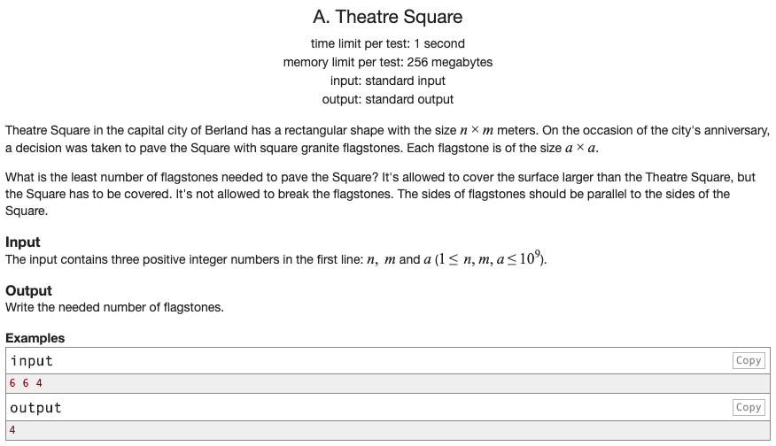

## 문제 파악

[Theatre Square 문제 링크](http://codeforces.com/problemset/problem/1/A){:target="_blank"}

n × m 미터의 직사각형 모양의 광장이 있을 때,  
a x a 미터의 정사각형 모양의 판석을 이용해 덮으려면 몇 개가 필요할 지를 구하는 문제다.  
이 때, 판석은 겹쳐질 수 있다.

## 문제 풀이

판석이 겹쳐질 수 있다는 조건이 있으므로, **판석이 광장의 크기에 딱 맞을 필요가 없다**.  
따라서, 각 방향으로 필요한 판석 수를 구해, 그 둘을 곱하면 필요한 전체 판석 수가 된다.

한쪽 방향에 대해서 광장의 크기를 판석으로 나눴을 때, 딱 맞지 않아 소숫점이 나올 수 있다.  
이 때, 판석을 겹칠 수 있으므로 정수로 **올림 처리**를 하면, 겹쳐지면서 필요한 판석 수가 구해진다.  
다른 방향에 대해서도 똑같은 방식으로 구할 수 있다.

## 풀이 소스

문제 풀이 환경: Python 3.7


import math

n, m, a = map(int, input().split())

hori_stones = math.ceil(n / a)
vert_stones = math.ceil(m / a)
result = hori_stones * vert_stones

print(result)

