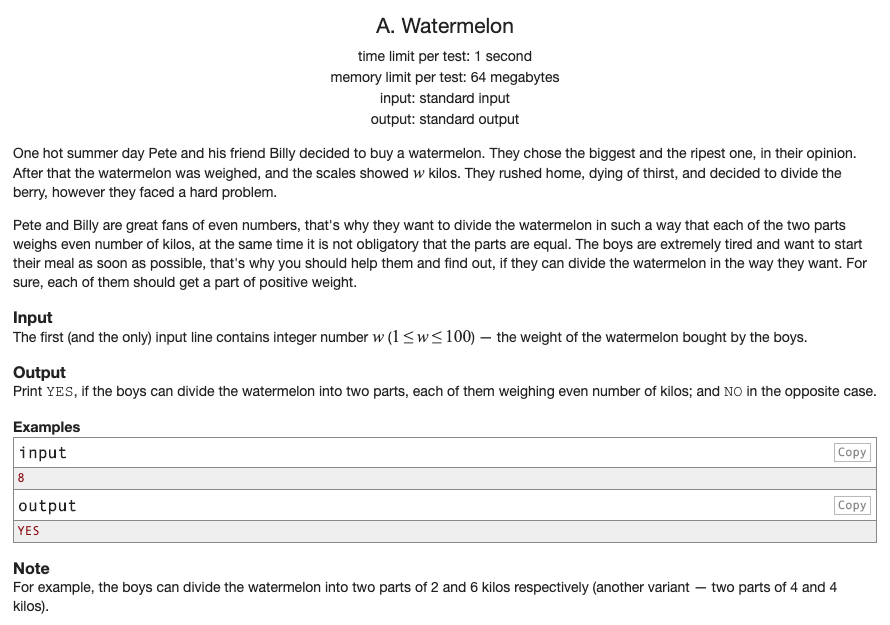

## 문제 파악

[Watermelon 문제 링크](http://codeforces.com/contest/4/problem/A){:target="_blank"}

1 이상 100 이하의 수박 무게가 주어졌을 때,  
짝수 무게로만 두 부분으로 나누어질 수 있다면 "YES"를 출력하고, 불가하면 "NO"를 출력한다.

## 문제 풀이

짝수 무게로만 두 부분으로 나누기 위해 **주어진 무게가 짝수**여야 2로 나누어 떨어질 수 있다.  
하지만, 무게가 2인 경우, 2로 나누면 1, 1이기 때문에 홀수가 되어버리므로 2를 제외해야 한다.

## 풀이 소스

문제 풀이 환경: Python 3.7


weight = int(input())
if weight % 2 is 0 and weight is not 2:
  print("YES")
else:
  print("NO")


문제 풀이 환경: Kotlin 1.3.61 (2019.12.10 추가)


fun main(args: Array<String>) {
    val weight = readLine()!!.toInt()
    println(if (weight % 2 == 0 && weight != 2) "YES" else "NO")
}

