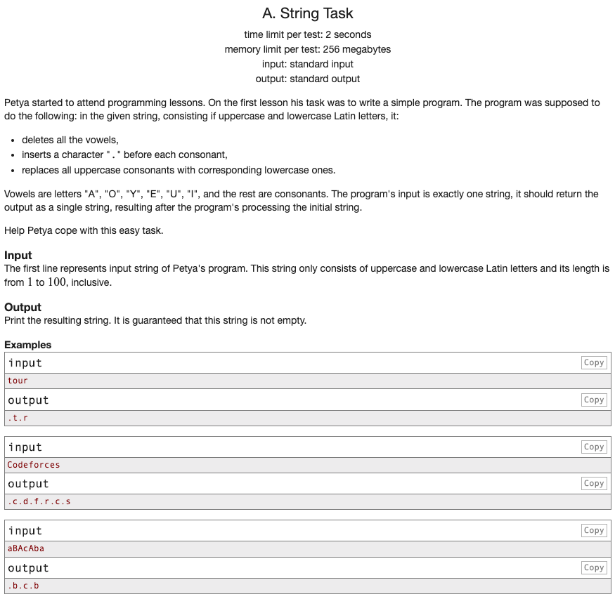

## 문제 파악

[String Task 문제 링크](http://codeforces.com/problemset/problem/118/A){:target="_blank"}

입력받은 문자열에 다음 규칙들을 적용한다.

- 문자열의 모음(A, O, Y, E, U, I)을 모두 없앤다.
- 각 자음 앞에 점 문자(".")를 하나 추가한다.
- 모든 대문자는 소문자로 변환한다.

## 문제 풀이

원활한 처리를 위해 규칙을 순차적으로 적용하는 것이 아닌 효율적인 순서로 적용할 수 있다.

모음을 없애기 전에 문자열을 소문자화 해서 대소문자 구분없이 모음을 제거할 수 있도록 한다.  
문자열의 문자를 순회하면서 모음 배열에 속하지 않도록 필터링을 한다.  
필터링된 문자열에 조인을 통해 점 문자를 삽입한다.  
조인할 때 첫 글자 앞에는 점 문자가 삽입되지 않으므로, 마지막에 점 문자를 문자열 앞에 추가한다.  
이때, 문자열이 존재하는 경우에만 점 문자를 추가하도록 한다.

## 풀이 소스

문제 풀이 환경: Python 3.7


string = input()

vowels = ['a', 'o', 'y', 'e', 'u', 'i']
result = string.lower()
result = ".".join(filter(lambda x: x not in vowels, result))
if len(result) > 0:
  result = '.' + result

print(result)

