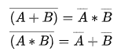

## 문제 파악

[Next Round 문제 링크](http://codeforces.com/problemset/problem/158/A){:target="_blank"}

k번째의 점수 이상이면, 다음 라운드로 넘어갈 수 있다.  
또한, 양수인 점수를 얻을 때만 가능하다.

점수가 양수이면서 k번째의 점수 이상인 사람 수를 세면 된다.

## 문제 풀이

두 번째 열의 입력을 배열로 받으면, k번째의 점수를 쉽게 얻을 수 있다.  
입력받은 점수 배열을 순회하면서 조건에 맞는 경우, 사람 수를 증가시킨다.

## 풀이 소스

문제 풀이 환경: Python 3.7


n, k = map(int, input().split())
scores = list(map(int, input().split()))

advancer_count = 0
for score in scores:
  if score > 0 and score >= scores[k - 1]:
    advancer_count += 1

print(advancer_count)


## 리팩토링

위 코드는 항상 입력받은 점수 배열의 요소를 모두 순회하도록 되어 있다.  
이를 개선시켜 **반대 조건일 때 순회를 중지**하도록 해 불필요한 순회를 하지 않도록 한다.

반대 조건을 구할 때, [드 모르간의 법칙][드 모르간의 법칙]{:target="_blank"}을 이용하면 쉽게 구할 수 있다.

말로 풀어 설명하면,  
`A 또는 B일 때의 부정`은 `A의 부정이고 B의 부정`과 같다.  
또한, `A이고 B일 때의 부정`은 `A의 부정 또는 B의 부정`과 같다.

Python으로 표현하면,  
`not (A or B) == not A and not B`이고, `not (A and B) == not A or not B`이다.

위 코드에서 `score > 0 and score >= scores[k - 1]`의 부정은 `not (score > 0 and score >= scores[k - 1])`이지만, 드 모르간의 법칙을 적용해 각각의 부정을 `or` 연산한 것으로 대체할 수 있다.

`score > 0`의 부정은 `score <= 0`이지만, 이 문제에서는 0 이하로는 입력될 수 없으므로 `score is 0`로 표현해도 된다. 또한, `score >= scores[k - 1]`의 부정은 `score < scores[k - 1]`이 된다.

결론적으로 다음과 같이 작성할 수 있다.


n, k = map(int, input().split())
scores = list(map(int, input().split()))

advancer_count = 0
for score in scores:
  if score is 0 or score < scores[k - 1]:
    break

  advancer_count += 1

print(advancer_count)


이로써 불필요한 순회를 줄일 수 있다.

[드 모르간의 법칙]: https://ko.wikipedia.org/wiki/%EB%93%9C_%EB%AA%A8%EB%A5%B4%EA%B0%84%EC%9D%98_%EB%B2%95%EC%B9%99#%EB%85%BC%EB%A6%AC_%ED%9A%8C%EB%A1%9C%EC%97%90%EC%84%9C%EC%9D%98_%EB%93%9C_%EB%AA%A8%EB%A5%B4%EA%B0%84%EC%9D%98_%EB%B2%95%EC%B9%99
