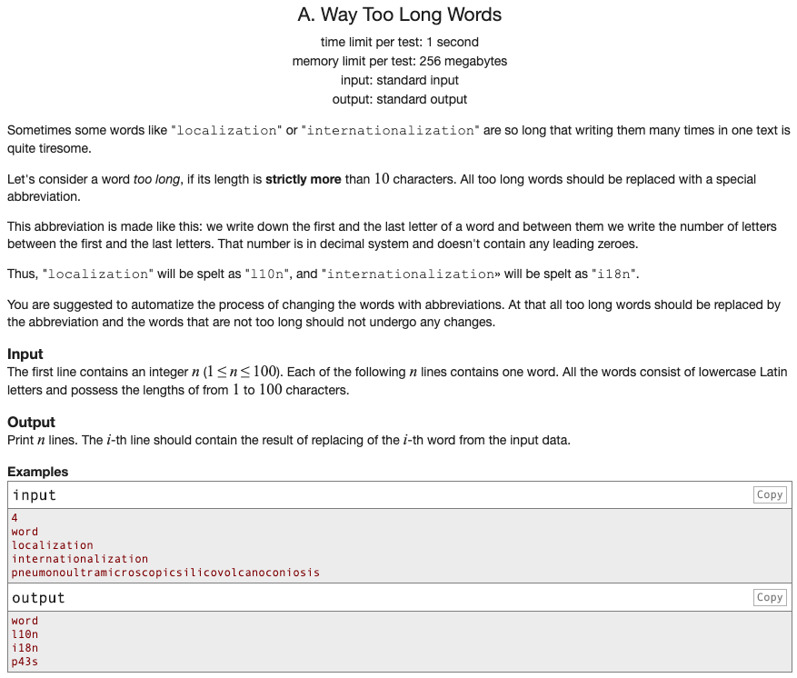

## 문제 파악

[Way Too Long Words 문제 링크](http://codeforces.com/problemset/problem/71/A){:target="_blank"}

입력받은 단어의 길이가 10자보다 긴 경우, 첫 글자와 마지막 글자를 제외한 나머지 글자는 글자수로 표현한다.  
10자 이하인 경우, 그대로 출력한다.

## 문제 풀이

단어의 길이가 10자를 초과하거나 이하인 경우로 분기해 로직을 처리할 수도 있으나,  
10자 이하인 경우에는 특별한 처리를 하지 않으므로 초과인 경우에만 단어를 변경해 결과를 수집한다.

Python은 `word[-1]`와 같이 **마이너스 인덱스**를 통해 마지막 요소에 접근할 수 있다.  
또한, 중앙의 글자수 부분은 전체 길이에서 첫 글자와 마지막 글자를 제외한 글자수이므로, 전체 길이에서 2를 빼면 된다.

## 풀이 소스

문제 풀이 환경: Python 3.7


n = int(input())
words = [input() for i in range(n)]

abbr_words = []
for word in words:
  if len(word) > 10:
    word = word[0] + str(len(word) - 2) + word[-1]
  abbr_words.append(word)

for word in abbr_words:
  print(word)

