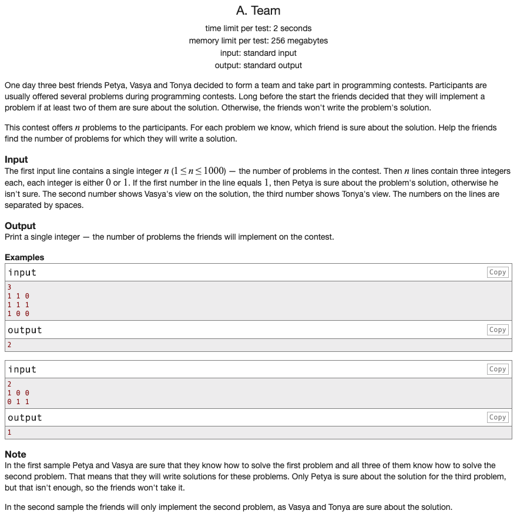

## 문제 파악

[Team 문제 링크](http://codeforces.com/problemset/problem/231/A){:target="_blank"}

3명이 각 문제의 정답을 확신하는 지를 입력받는다.  
정답 확신 수가 2명 이상일 때의 개수를 세면 된다.

## 문제 풀이

입력받는 시점에서 3명의 정답 확신 여부를 튜플로 준비해두면, 해당 값들을 원활하게 이용할 수 있다.  
확신 여부는 숫자 0 또는 1로 입력받으므로 이를 이용해 총 확신 여부 수를 알 수 있다.  
Python은 `sum` 함수를 기본적으로 제공하므로, 각 튜플에 `sum` 함수를 적용해 확신 여부의 합을 구하면 그것이 문제에 대한 확신 여부 수가 된다.  
확신 여부 수가 2 이상일 때만 개수를 올리도록 한다.

다른 방식으로 확신 여부 수가 2 이상일 때는 1을 반환하고, 아닐 때는 0을 반환해 `sum` 함수를 적용하는 방법이 있다.  
하지만, 2 미만일 때도 0을 더하는 연산을 수행하므로 불필요한 연산이 발생한다.


n = int(input())
isSureList = [tuple(map(int, input().split())) for i in range(n)]

count = sum(1 if sum(isSure) >= 2 else 0 for isSure in isSureList)

print(count)


## 풀이 소스

문제 풀이 환경: Python 3.7


n = int(input())
isSureList = [tuple(map(int, input().split())) for i in range(n)]

count = 0
for isSure in isSureList:
  if sum(isSure) >= 2:
    count += 1

print(count)

