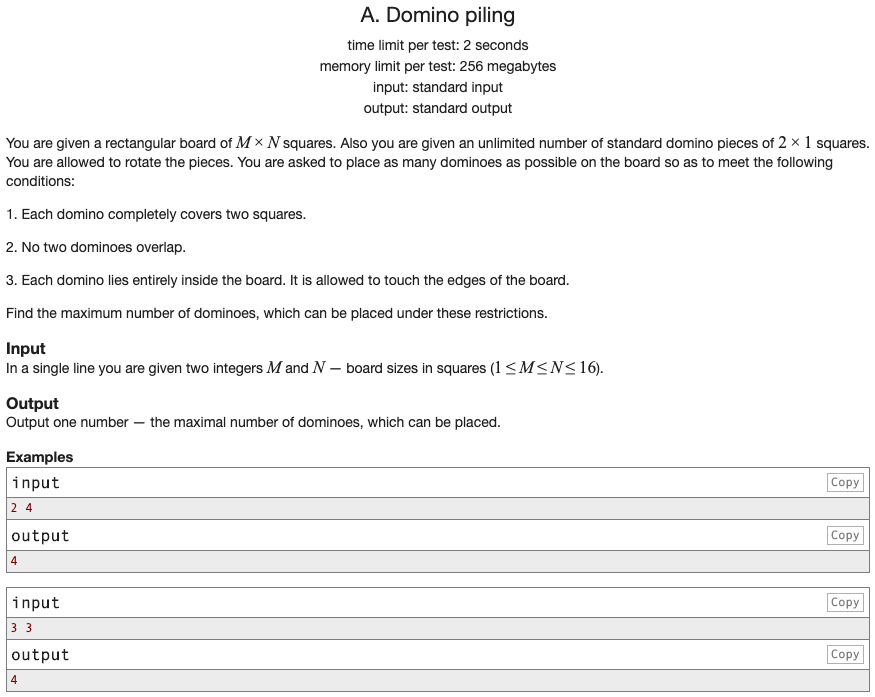

# 문제 파악

[Domino piling 문제 링크](http://codeforces.com/problemset/problem/50/A){:target="_blank"}

2 x 1 크기의 도미노 조각을 이용해 M x N 크기의 판을 채울 때, 필요한 최대 도미노 조각 수를 구한다.  
이때, 도미노 조각은 서로 겹칠 수 없으며, 판 안에 존재해야 한다.

# 문제 풀이

조각의 긴 변이 높이가 되도록 세운 후, 판의 좌상단 부분부터 채운다.  
여기서 긴 변은 2가 되고, 1 크기의 변으로 한 줄부터 채운다고 생각하면, 판의 너비와 동일하게 된다.  
따라서, 하나의 줄을 채우는데 필요한 조각 수는 `N`만큼이 된다.  
반복적으로 여러 줄에 대해 채울 수 없을 때까지 조각을 채우면, 반복적으로 `N`을 개수에 더하면 된다.

하나의 줄에 더 이상 조각을 세운 채로(긴 변이 높이가 되도록) 채울 수 없으면, 눕혀서 채운다.  
조각을 눕히면 조각의 너비는 2가 되고, 판의 너비에 대해 최대로 넣는 개수는 `(N / 2)의 내림 수`만큼이 된다.  
Python에서는 `int()` 함수를 이용하면, 정수로 변환하며 **자동으로 소숫점을 내림 처리**한다.  
눕혀서 채우는 것을 마지막으로 개수에 더하면, 총 조각 수를 구할 수 있다.


m, n = map(int, input().split())

result = 0
while m > 0:
  result += n if m > 1 else int(n / 2)
  m -= 2

print(result)


도미노 조각의 높이와 너비를 일반화해서 코드를 수정하면 다음과 같다.


m, n = map(int, input().split())
piece_height = 2
piece_width = 1

result = 0
while m > 0:
  # result += int(n / piece_width) if m > piece_height - 1 else int(n / piece_height)
  result += int(n / (piece_width if m > piece_height - 1 else piece_height))
  m -= piece_height

print(result)


하지만, 이 문제의 경우, **조각의 크기가 2 x 1**인 관계로 더 간단한 풀이가 가능하다.  
사각형 모양의 판을 한 줄로 쭉 펴고 조각을 눕혀서 채우면, 한 번의 계산 만으로 총 조각 수를 구할 수 있다.  
왜냐하면, 좌상단 부분부터 최대한 채워서 남는 영역은 판의 마지막 줄의 우측 부분이기 때문이다.  
(항상 마지막 줄을 제외한 나머지 줄을 꽉 채울 수 있다.)

# 풀이 소스

문제 풀이 환경: Python 3.7


m, n = map(int, input().split())

result = int(m * n / 2)

print(result)

