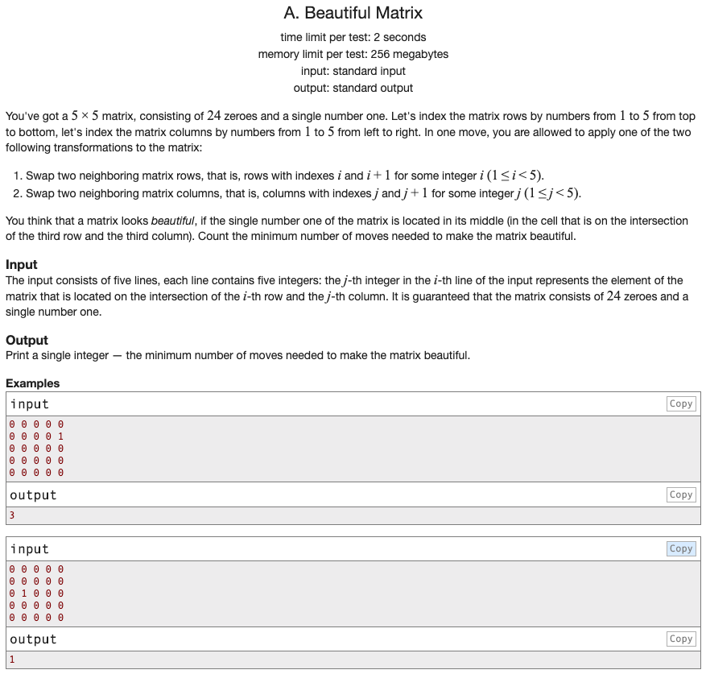

# 문제 파악

[Beautiful Matrix 문제 링크](http://codeforces.com/problemset/problem/263/A){:target="_blank"}

5 x 5 크기와 그 안에 오직 하나의 1과 나머지는 0인 배열이 주어진다.  
1이 배열의 정가운데에 위치하게 하기 위해, 반복적으로 인접해 있는 요소끼리 자리를 1칸씩 바꿀 수 있다.  
이때, 그렇게 하기 위해 필요한 최소 이동 수를 구해야 한다.

# 문제 풀이

이 문제에서 자리를 바꾸는 방향이 제약되어 있다던지 등과 같은 특별한 제약이 걸려있지 않다.  
따라서, 단순히 이동 거리만 계산하면 되고 목적지가 정해져 있으므로, 1의 위치를 구해 정가운데와의 거리를 구하면 된다.

1의 위치를 구하는 것은 다양한 방법이 있을 수 있는데, 여기서는 `index()` 함수를 이용해 구했다.  
`index()` 함수는 인자로 전달받은 값에 해당하는 요소의 **첫 위치**를 반환한다.  
첫 위치를 반환하기 때문에 추가적인 불필요한 순회를 하지 않는다.

`index()` 함수는 인자에 해당하는 요소가 존재하지 않으면 `ValueError` 예외를 던진다.  
따라서, 반드시 예외 처리가 필요하다. 그렇지 않으면, 첫 번째 줄에서 바로 실패해버리는 불상사가 발생한다.  
또한, 바깥 쪽도 불필요한 순회를 하지 않기 위해, 1이 발견되면 바로 순회를 중지하도록 한다.

그래프에서 두 점의 거리는 두 점의 차이의 절댓값과 같기 때문에, 정가운데 위치를 빼고 `abs()` 함수로 절댓값을 구한다.

# 풀이 소스

문제 풀이 환경: Python 3.7


matrix = [list(map(int, input().split())) for _ in range(5)]

index = (0, 0)
for i in range(5):
  try:
    index = (i, matrix[i].index(1))
    break
  except ValueError:
    continue

result = abs(index[0] - 2) + abs(index[1] - 2)

print(result)

