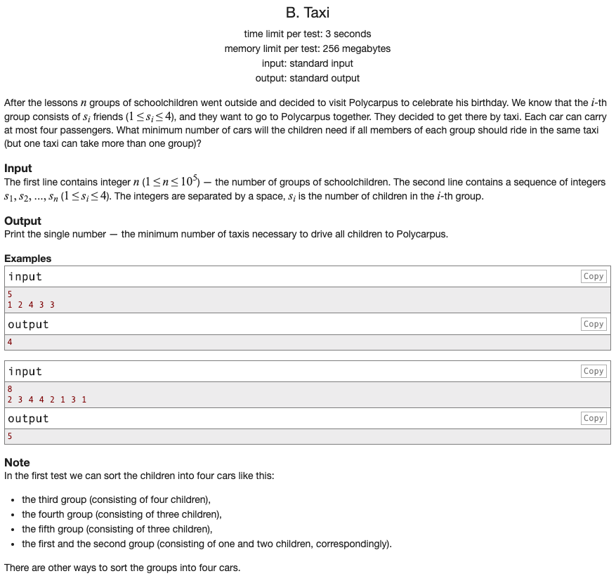

## 문제 파악

[Taxi 문제 링크](http://codeforces.com/problemset/problem/158/B){:target="_blank"}

1~4명으로 이루어진 다수의 그룹이 있고, 최대 4명이 탈 수 있는 택시를 탄다면, 몇 대의 택시가 필요할 지 구해야 한다.  
이때, 한 대의 택시에 4명을 초과하지 않는다면 여러 그룹이 탈 수 있다.  
또한, 한 그룹의 학생들은 모두 동일한 택시에 타야 한다.

예를 들어, 아래와 같이 입력이 주어진다면,


5
1 2 4 3 3


다음과 같이 4대의 택시가 필요하다.

- 4명으로 구성된 3번째 그룹은 1대의 택시에 탄다.
- 3명으로 구성된 4, 5번째 그룹은 각각 1대의 택시에 탄다.
- 2명으로 구성된 2번째 그룹은 1대의 택시에 탄다.
- 1명으로 구성된 1번째 그룹은 2명 또는 3명으로 구성된 택시에 같이 탄다.

다수의 그룹이 같이 탈 수 있는 경우를 고려해야 한다.

## 문제 풀이

문제의 예시에서도 힌트가 주어졌듯이, 택시를 채울 수 있는 경우의 수를 하나씩 생각해가며 문제를 해결할 수 있다.  
이렇게 그때그때 최적의 답을 구해서, 최종적으로 최적의 해답을 구하는 방식을 [탐욕(Greedy) 알고리즘][탐욕 알고리즘]{:target="_blank"}이라 한다.  
이 알고리즘은 **지역적으로 최적이면서 전역적으로 최적인 문제**에만 적용할 수 있다.

이 문제에서 택시의 최대 탑승 가능 인원 수는 정해져 있고, 그룹이 몇 명으로 구성되어 있는 지 알 수 있다.  
따라서, 특정 조건으로 생각하면, 탐욕 알고리즘 방식으로 **그때그때 택시가 몇 대가 필요한 지** 구할 수 있다.
이때 특정 조건을 **인원 수에 따라 그룹을 분류**하는 것을 생각해 볼 수 있다.

- 택시에 3명 또는 4명 그룹이 탑승한다면, 한 번에 2그룹이 탑승할 수 없으므로 필요한 택시 수는 3명 그룹의 수 + 4명 그룹의 수와 동일하다.
- 택시에 2명 그룹이 탑승한다면, 한 번에 최대 2그룹이 탑승할 수 있으므로 2를 나눠 올림 처리(`ceil(c2 / 2)`)하면 필요한 택시 수를 구할 수 있다.

택시에 1명 그룹이 탑승할 때는 2명 또는 3명 그룹이 탑승한 택시에 같이 탈 수 있으므로 까다로워진다.  
3명 그룹에 동승할 때는 한 대의 택시에 한 자리만 비어 있으므로, 해당 그룹 수만큼 1명 그룹이 탑승할 수 있다.  
2명 그룹에 동승할 때는 빈 자리가 생겨봐야 한 대에 2자리만 비어 있으므로, 최대 2만큼 1명 그룹이 탑승할 수 있다.  
따라서, 동승하는 만큼 1명 그룹의 수를 제외(`max(c1 - (c2 % 2) * 2 - c3, 0)`)하고, 한 대 택시에 4그룹이 타는 것을 고려해 4를 나눠 올림 처리(`ceil(c1 / 4)`)하면 필요한 택시 수를 구할 수 있다.  
이때, `max()` 함수를 이용한 이유는 동승 그룹 수가 더 많은 경우, 0그룹으로 처리하기 위해서이다.

참고로 처음에 입력받을 때, 풀이 소스와 같이 처리하면 입력과 동시에 각 변수에 **인원 수 별 그룹 수**를 할당할 수 있다.  
`map()` 함수로 `input().count()` 함수의 인자에 `['1', '2', '3', '4']` 리스트의 각 숫자를 전달해, 입력받은 문자열(`input()`)에 각 숫자가 몇 개 들어 있는 지 구할 수 있다.  
그렇게 각 숫자의 개수(그룹 수)가 차례대로 `c1, c2, c3, c4` 변수에 대입된다.

첫 줄의 입력은 사용하지 않아도 되므로, 무시하도록 처리했다. (`_ = input()`)  
`_` 변수는 사용하려면 사용할 수 있지만, Python에서는 **대입되는 값을 무시하는 용도**로 많이 사용된다.

## 풀이 소스

문제 풀이 환경: Python 3.7


from math import ceil

_ = input()
c1, c2, c3, c4 = list(map(input().count, ['1', '2', '3', '4']))

c1 = max(c1 - (c2 % 2) * 2 - c3, 0)
taxi_count = c4 + c3 + ceil(c2 / 2) + ceil(c1 / 4)

print(taxi_count)


[탐욕 알고리즘]: https://en.wikipedia.org/wiki/Greedy_algorithm
