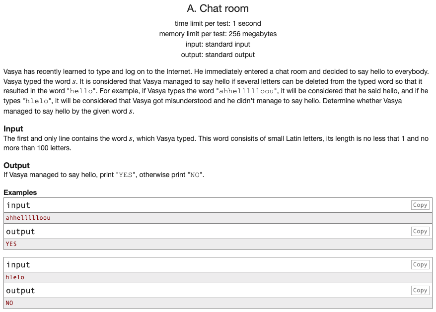

## 문제 파악

[Chat room 문제 링크](http://codeforces.com/problemset/problem/58/A){:target="_blank"}

입력한 문자열에 "hello" 문자열의 문자들이 분해되어 차례대로 존재하는지 판단하는 문제이다.  
각 문자 사이에는 다른 문자가 존재할 수 있으며, 단지 한 글자씩 차례대로 추출해 "hello" 문자열을 완성할 수 있으면 된다.

예를 들어,  
"ahhellllloou" 문자열은 2번째 'h', 4번째 'e', 5~6번째 "ll", 10번째 'o'까지 차례대로 존재하므로 "YES"를 출력한다.  
반면에, "hlelo" 문자열은 1번째 'h', 3번째 'e', 4번째 'l'까지 만족하지만, 그 이후로 다른 'l'이 없어 "NO"를 출력한다.

## 문제 풀이

이 문제는 [탐욕(Greedy) 알고리즘][탐욕 알고리즘]{:target="_blank"}으로 해결할 수도 있지만,
[정규 표현식(정규식, Regular Expression, regex)][정규 표현식]{:target="_blank"}을 이용하면 더 쉽게 해결할 수 있다.

### 탐욕 알고리즘

탐욕 알고리즘을 사용한다면, 입력받은 문자열이 **"hello" 문자열의 문자를 하나씩 차례대로 만족하는지**를 확인하면 된다.  
하나를 만족할 때마다 지역적으로 최적이기 때문에 최종적으로 'o'를 만족하면, 해당 문자열은 문제의 조건을 만족한다.

### 정규 표현식

정규 표현식(이하 정규식)은 문자열에 특정 패턴이 존재하는지 확인하거나 다른 문자열로 교체하는 등의 작업을 가능하게 해주는 형식 언어이다.  
추출하고자 하는 문자열의 패턴이 일정하다면, 언제든지 정규식을 이용해 해당 부분을 추출할 수 있다.

이 문제에서 판단하고자 하는 문자열은 일정한 패턴을 가지고 있다.  

1. "hello" 문자열의 문자들은 **차례대로 존재**해야 한다.
2. "hello" 문자열의 **각 문자 사이에는 어떤 문자도 존재**할 수 있다.

이를 차례대로 정규식으로 표현하면 다음과 같다.

1. `hello`
2. 각 문자 사이에 `.*`

최종적으로 `h.*e.*l.*l.*o`와 같은 정규식이 탄생한다.  
이는 **각 문자 'h', 'e', 'l', 'l', 'o' 사이에 어떤 문자든 0자 이상이 존재**한다는 의미이다.

Python에서 `re` 모듈을 통해 위 정규식에 해당하는 부분 문자열을 검색해, 조건을 만족하는지 판단할 수 있다.

## 풀이 소스

문제 풀이 환경: Python 3.7


import re

print('YES' if re.search(r'h.*e.*l.*l.*o', input()) else 'NO')


[탐욕 알고리즘]: https://en.wikipedia.org/wiki/Greedy_algorithm
[정규 표현식]: https://ko.wikipedia.org/wiki/%EC%A0%95%EA%B7%9C_%ED%91%9C%ED%98%84%EC%8B%9D
