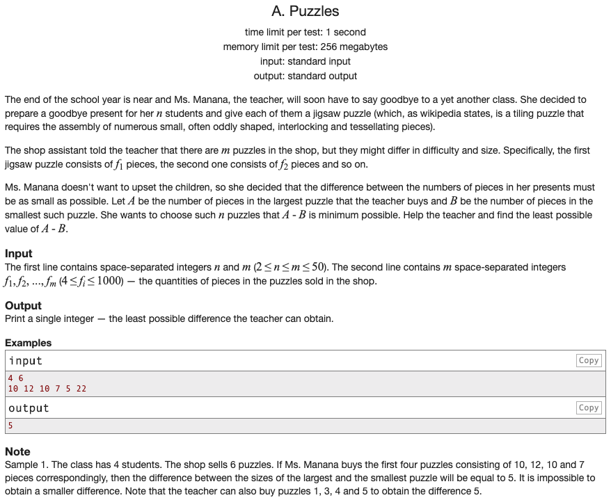

## 문제 파악

[Puzzles 문제 링크](http://codeforces.com/problemset/problem/337/A){:target="_blank"}

첫 줄에 학생 수와 상점에서 판매하는 직소 퍼즐의 수가 주어지고, 둘째 줄에 각 퍼즐의 조각 수가 주어진다.  
학생 수에 맞춰 다수의 직소 퍼즐을 구매할 때, **퍼즐 간의 최대 조각 수 차이가 가장 작을 때의 조각 수 차이**를 구해야 한다.  
판매하는 퍼즐의 수는 학생 수보다 크거나 같으므로, 퍼즐 간의 최대 조각 수 차이는 여러 경우가 나올 수 있기 때문이다.

## 문제 풀이

[탐욕(Greedy) 알고리즘](https://en.wikipedia.org/wiki/Greedy_algorithm)의 접근 방식을 이용해 풀이할 수 있다.  
각 경우에서 최적해를 먼저 구하고, 구한 최적해들을 이용해 최종 최적해를 구한다.

무작위로 학생 수에 맞춰 퍼즐을 선택하는 것은 경우의 수가 너무 많고 효율이 떨어진다.  
퍼즐을 조각 수를 기준으로 정렬한다면, 최대 조각 수 차이가 가장 작게 되도록 퍼즐끼리 인접한 그룹을 형성할 수 있다.  
**해당 그룹에서 최대 조각 수 차이를 구하고, 구한 최대 조각 수 차이들 중에 가장 작은 값이 정답이 된다.**

각 그룹은 이미 조각 수에 따라 정렬되어 있으므로, **최대 조각 수 차이는 그룹의 끝과 처음의 값 차이**로 구할 수 있다.

예를 들어, 주어진 예시를 정렬 후에 각 경우에 따라 추적하면 다음과 같다.


5 7 10 10 12 22 : 정렬된 퍼즐 조각 수 목록
5 7 10 10       : 최대 조각 수 차이 = 10 - 5 = 5
  7 10 10 12    : 최대 조각 수 차이 = 12 - 7 = 5
    10 10 12 22 : 최대 조각 수 차이 = 22 - 10 = 12


따라서, 정답에 해당하는 퍼즐 그룹은 `5 7 10 10` 또는 `7 10 10 12`가 되고, 가장 작은 값은 `5`가 된다.

## 풀이 소스

문제 풀이 환경: Python 3.7


n, _ = map(int, input().split())
counts = sorted(list(map(int, input().split())))

result = min(counts[i + n - 1] - counts[i] for i in range(len(counts) - n + 1))

print(result)

