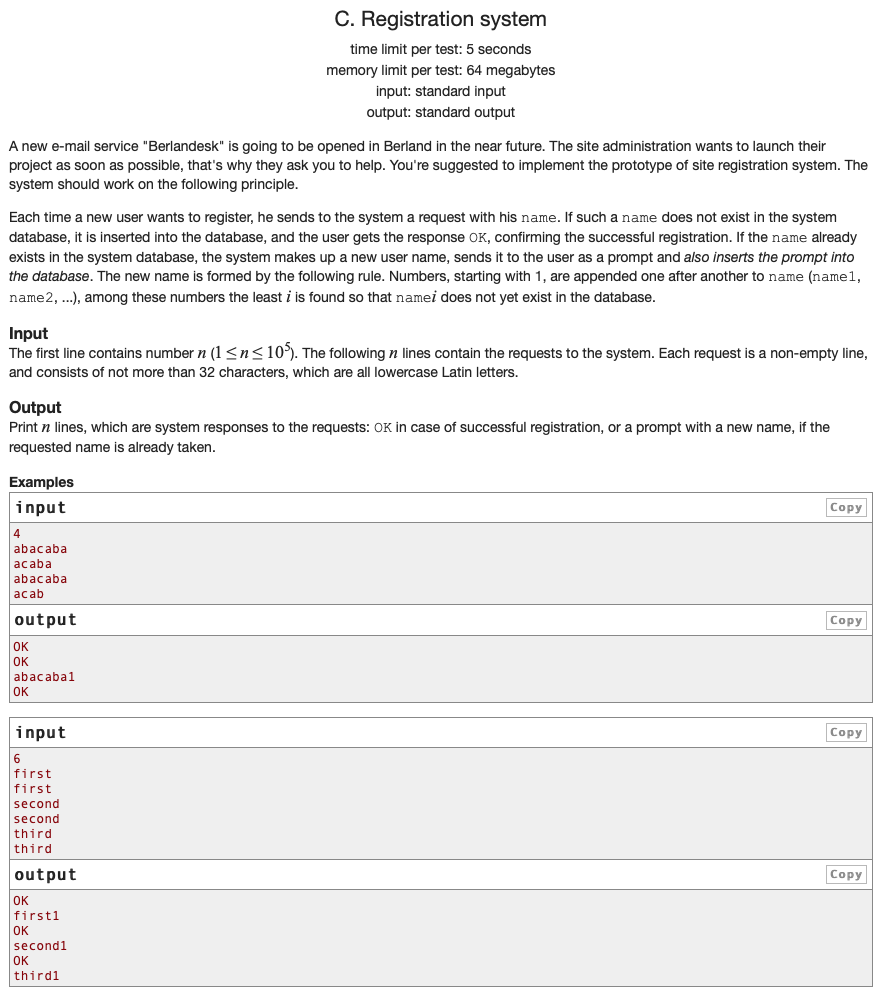

## 문제 파악

[Registration system 문제 링크](http://codeforces.com/problemset/problem/4/C){:target="_blank"}

사용자 이름을 등록하는 시스템으로 중복 이름을 허용하지 않는다.  
다수의 이름을 입력받아 차례대로 시스템에 등록을 요청해 정상적으로 등록되는 경우, "OK"를 출력한다.  
이름이 중복되는 경우, 이름 뒤에 숫자를 추가해 등록하고 변경된 이름을 출력한다.  
중복되는 이름이 다수인 경우, 차례대로 숫자를 증가시켜 추가한다.  
입력하는 이름은 모두 소문자 영문자만 가능하다. (숫자를 입력하는 경우가 없다.)

## 문제 풀이

중복되는 이름이 다수인 경우에 차례대로 숫자를 증가시켜 추가해야 하므로, 중복될 때마다 그 수를 기억해야 한다.  
그러면, 저장할 데이터는 이름과 중복 수가 되고, 이를 효율적으로 관리하기 위해 [해시][해시]{:target="_blank"} 테이블을 사용할 수 있다.

**해시 테이블**은 Key-Value 구조로 데이터를 보관하는 자료구조로, Key를 위해 해시 함수를 이용한다.  
일반적으로 별도의 해시 함수를 구현하지 않으면, 객체의 주소값 등을 Key로 이용할 수 있다.

Python에서는 이러한 해시 테이블로 이용할 수 있는 자료구조로 **Dictionary**라 하는 `dict`가 존재한다.  
이 문제에서 입력받는 이름을 Key로, 중복 수를 Value로 사용하면, 효율적으로 데이터를 보관할 수 있다.  
키를 바탕으로 값에 접근하기 때문에 순차적으로 검색해서 원하는 값을 얻는 배열에 비해 효율적이고, 편리하다.

입력받은 이름들을 차례대로 Dictionary에 존재하는지 확인하고, 존재하면 중복 수를 증가시키고, 존재하지 않으면 Dictionary에 추가한다.
키로 존재 여부를 확인하고, 키로 값에 접근하기 때문에 속도가 매우 빠르다.  
중복되는 경우, 중복 수를 이용해 이름을 변경하도록 한다.

## 풀이 소스

문제 풀이 환경: Python 3.7


n = int(input())
names = [input() for _ in range(n)]

name_dict = dict()
for i, name in enumerate(names):
  if name in name_dict:
    names[i] += str(name_dict[name])
    name_dict[name] += 1
  else:
    names[i] = "OK"
    name_dict[name] = 1

for name in names:
  print(name)


[해시]: https://namu.wiki/w/%ED%95%B4%EC%8B%9C
