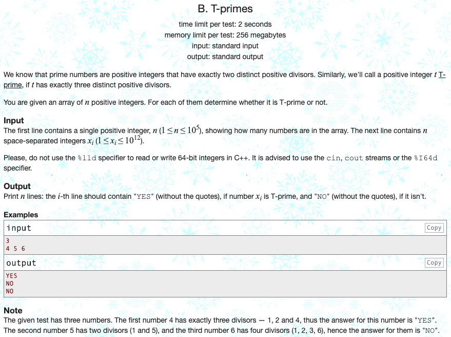

## 문제 파악

[T-primes 문제 링크](http://codeforces.com/problemset/problem/230/B){:target="_blank"}

정확히 3개의 소인수로 분해되는 숫자를 T-prime이라 정의한다.  
이때, 주어진 숫자들이 T-prime이면 "YES"를, 아니라면 "NO"를 출력한다.

## 문제 풀이

어떤 숫자 T-prime인지 판별하려면, 그 조건을 명세화해야 한다.

소인수가 3개가 되기 위해서, 1과 자기 자신을 제외한 숫자 1개는 **제곱근**이 되어야 한다.  
또한, 그 제곱근이 소수여야 더 이상 소인수로 분해되지 않으므로, 3개의 소인수가 남을 수 있다.  
따라서, T-prime이 되기 위한 조건은 다음과 같다.

1. 대상 수의 제곱근은 **소수**여야 한다.
2. 대상 수의 제곱근을 **정수화**하고 다시 제곱했을 때, 본래의 수와 동일해야 한다. (제곱근이 정수여야 한다.)

이때, 제곱근이 소수인지 판별하는 로직이 필요하다.  
공간이 충분할 때, 효율적이고 빠른 방법으로 [에라토스테네스의 체(Sieve of Eratosthenes)][에라토스테네스의 체]{:target="_blank"}가 있다.

에라토스테네스의 체는 **특정 범위의 수를 체로 걸러내듯이 소수가 아닌 수를 걸러 소수만 남겨내는 방법**이다.  
이때, 작은 수부터 차례대로 증가시키면서 소수인 경우, 범위 내 배수를 모두 소수에서 걸러내는 방식을 취한다. (배수는 분해가 된다는 뜻이므로, 소수에 해당하지 않는다.)  
특정 범위의 수 목록에 소수 여부를 미리 저장해두고, 원하는 수의 소수 여부만 확인하므로 매우 빠르게 판별할 수 있다.  
단순히 적은 횟수만 소수 판별을 한다면, 에라토스테네스의 체는 굳이 필요하지 않다.  
소수 판별을 많이 해야 할 때, 그때그때 소수를 판별한다면 시간이 오래 걸리므로, 소수 여부를 미리 계산하는 것이다.

에라토스테네스의 체를 구할 때, 연산을 최소화하기 위해 대상 수의 제곱근까지만 순회하면 모든 소수를 구할 수 있다.  
이 문제에서는 **대상 수의 제곱근의 소수 여부**가 궁금하므로, **소수 여부를 구하는 범위를 제곱근까지로 한정**지었다.

만약 대상 수까지의 소수 여부를 구한다고 하면, 다음과 같이 구할 수 있다.


target = 1000000000000
primes = [False] * 2 + [True] * (target - 1)

limit = int(target ** .5) + 1
for i in range(2, limit):
  if primes[i]:
    for j in range(i ** 2, target + 1, i):
      primes[j] = False


## 풀이 소스

문제 풀이 환경: Python 3.7


_ = input()
x = map(int, input().split())

limit = int(1000000000000 ** .5) + 1
primes = [False] * 2 + [True] * (limit - 2)
for i in range(2, limit):
  if primes[i]:
    for j in range(i ** 2, limit, i):
      primes[j] = False

for num in x:
  sqrt = int(num ** .5)
  print("YES" if primes[sqrt] and sqrt ** 2 == num else "NO")


[에라토스테네스의 체]: https://ko.wikipedia.org/wiki/%EC%97%90%EB%9D%BC%ED%86%A0%EC%8A%A4%ED%85%8C%EB%84%A4%EC%8A%A4%EC%9D%98_%EC%B2%B4
