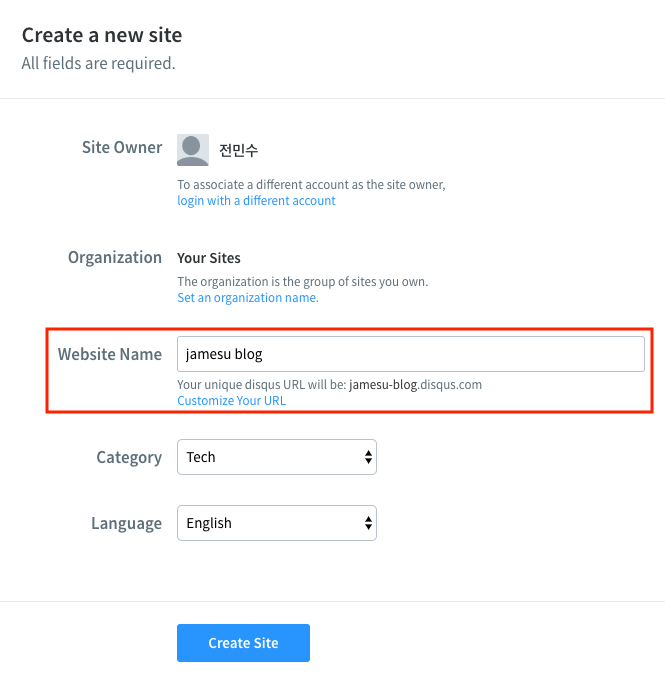
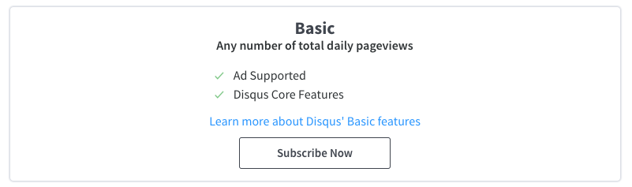
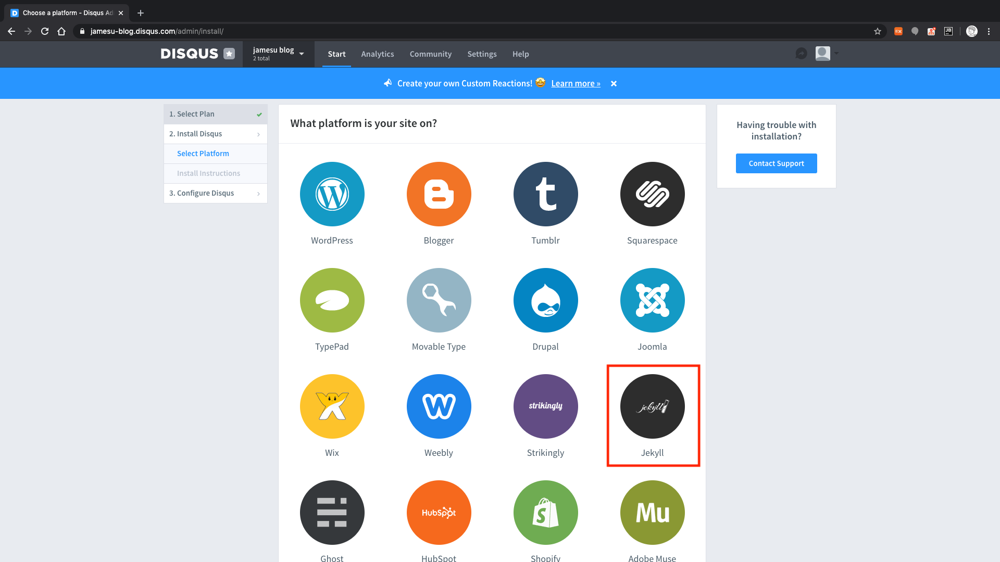
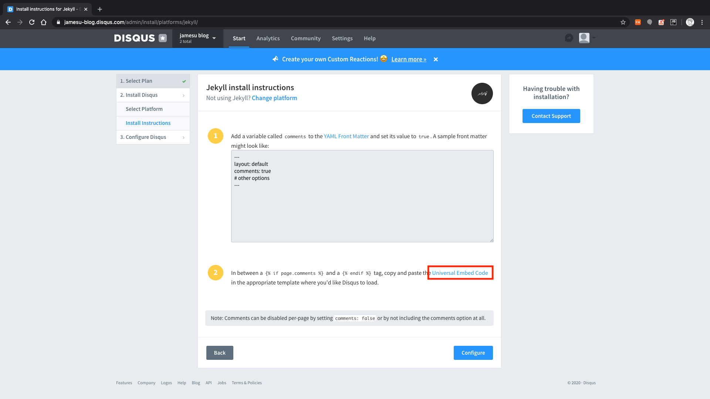
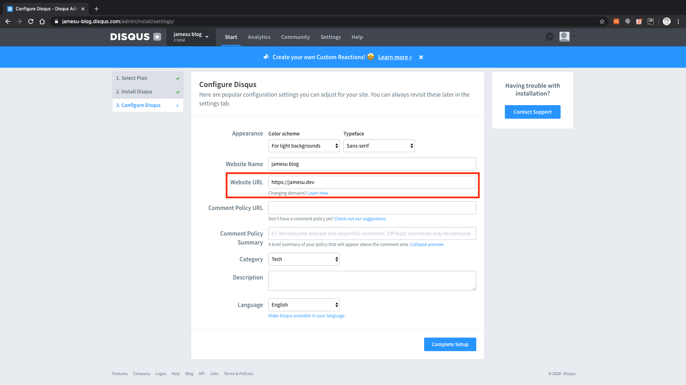
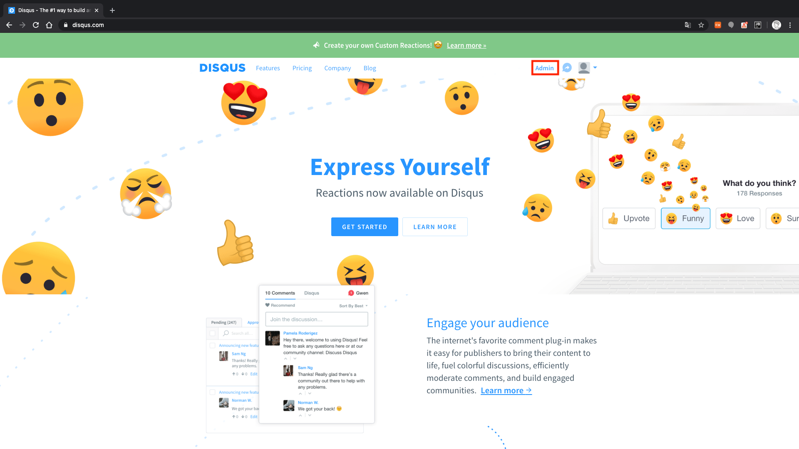
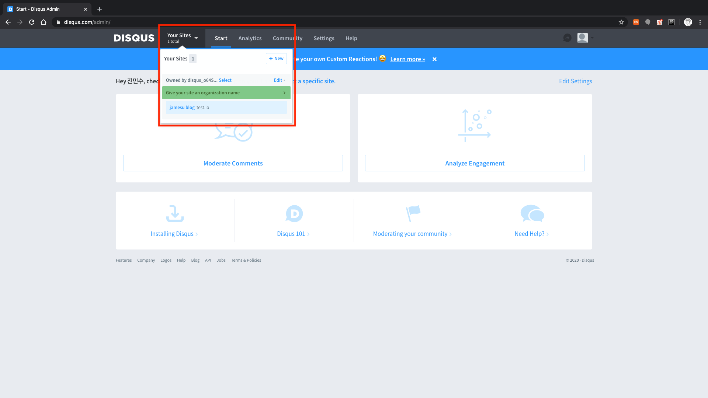
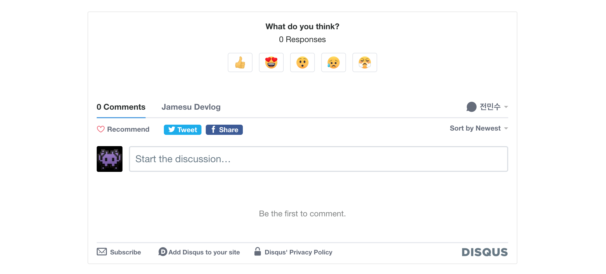

## 별도의 댓글 서비스를 이용해야 하는 이유

Jekyll을 통해 생성한 블로그는 **정적으로 생성된 블로그**이다.  
이 말은 즉, 동적으로 데이터를 보관하며 사용자에게 보여줄 수 있는 블로그가 아니다.

댓글 서비스를 운영하기 위해서는 댓글이라는 데이터의 보관이 필요하고, 이는 Jekyll만 사용해서는 불가능하다.  
따라서 외부 플러그인을 통해 댓글 서비스를 이용하는 방법을 사용하도록 한다.  
여기서는 많은 GitHub Pages 블로그에서 사용하고 있는 Disqus 댓글 서비스를 연동하도록 한다.

Disqus에서 제공하는 댓글 서비스는 간단한 블로그를 위해서는 무료 정책으로 충분하다.  
혹시 다른 부가적인 기능이나 특징이 필요하다면, [여기][Disqus 가격 정책]{:target="_blank"}에서 가격 정책을 확인할 수 있다.

## Disqus 가입 및 설정

블로그는 이미 준비되어 있다고 가정하고, 일단 Disqus에 가입해서 블로그 정보를 설정해야 한다.  
[Disqus][Disqus]{:target="_blank"}에 접속해 이메일 또는 페이스북, 트위터, 구글 등의 계정을 통해 가입한다.

가입 후에 홈페이지에서 'GET STARTED' > 'I want to install Disqus on my site' 순서로 버튼을 누른다.  
생성 화면에서 'Website Name'은 Disqus의 관리자 사이트로 이용되므로 블로그와 관련된 이름으로 작성한다.  
이때, 생성되는 URL은 Disqus에서 유일해야 하므로 유의하도록 한다.  
언어는 현재 한국어를 제공하지 않으므로 영어로 선택해 진행한다.

&nbsp;  

플랜은 'Basic' 플랜의 'Subscribe Now' 버튼을 눌러 무료 플랜을 선택한다.

&nbsp;  

플랫폼 선택 화면에서 'Jekyll' 항목을 누른다.

&nbsp;  

그러면 Jekyll에 댓글 서비스를 설정하는 방법이 나오는데, 아래에서 알아보도록 한다.  
여기서는 **2번 항목의 'Universal Embed Code' 링크**만 새 창에 띄워 놓고, 'Configure' 버튼을 누른다.  
해당 링크는 추후 댓글 서비스를 설정할 때 필요한 페이지로, **설정한 사이트마다 다른 코드가 생성되므로 미리 띄워 놓는다**.

&nbsp;  

설정 화면에서 필요한 항목들을 작성하도록 한다.  
**'Website URL' 항목이 실제 연동할 사이트 주소에 해당한다**.  
여기서 'Comment Policy' 관련 항목들은 입력하지 않으면, 알아서 Disqus 정책에 따라 적용된다.  
'Complete Setup' 버튼을 누르면, Disqus에 사이트 설정이 완료된다.

&nbsp;  

사이트 설정이 완료된 후에는 언제든지 Admin 화면으로 접속해 사이트를 관리할 수 있다.  
생성 시에 설정한 것들 외에도 다양한 옵션이 있으니 살펴보는 것도 좋을 것 같다.

&nbsp;  

## Disqus 연동

앞서 띄워 놓은 'Universal Embed Code' 링크 페이지를 열어 보면, 첫 1번 항목에 소스 코드가 있을 것이다.  
이 소스 코드가 **Disqus 댓글 영역이 생기는 부분**이다.



<noscript>Please enable JavaScript to view the <a href="https://disqus.com/?ref_noscript">comments powered by Disqus.</a></noscript>


만약, 해당 링크 페이지를 별도로 띄워 놓지 않았다면, 위 코드를 그대로 붙여 넣은 후, 15번째 줄에 `s.src`에 대입하는 부분에 블로그에 해당하는 Disqus 관리자 사이트 URL을 입력하면 된다.  
`jamesu-blog` 대신, 해당하는 **관리자 사이트 URL**을 입력하도록 한다.

그리고 Disqus는 다음과 같은 추가 작업을 추천한다.  
(전체 내용은 [이 문서][Disqus split threads 문제]{:target="_blank"}를 참고한다.)

> This works well for some sites, however, this method of creating threads can lead to duplicate “split threads” for the same page of content, especially when your site accepts many different URLs for the same page of content.

즉, 같은 컨텐츠이지만 접근하는 URL이 달라 서로 다른 쓰레드(댓글 그룹)가 생성될 수도 있다는 말이다.

예를 들어, 로컬 환경에서 띄운 블로그와 실제 배포된 블로그에 각각 접근했을 때, 서로 다른 쓰레드가 생성될 수 있다.  
로컬 환경은 URL이 `localhost`로 시작하고, 배포된 블로그는 `실제 도메인`으로 시작하기 때문이다.  
서로 다른 쓰레드는 같은 컨텐츠임에도 불구하고, **댓글의 불일치**를 발생시킬 수 있다.

이런 현상을 방지하기 위해, 아래와 같이 주석을 해제하여 `disqus_config` 함수를 정의하도록 한다.




<noscript>Please enable JavaScript to view the <a href="https://disqus.com/?ref_noscript">comments powered by Disqus.</a></noscript>



`this.page.url` 변수에는 동일한 URL을 가리키도록, 도메인 주소와 `{{ page.url }}`을 이용한다.  
`this.page.identifier` 변수에는 `{{ page.id }}`를 이용해 유일한 페이지 ID를 대입한다.

### 댓글 영역을 꾸미고 싶다면

위 코드에서 보이는 것처럼, `

` 요소 내부에 댓글 영역이 생긴다.  
댓글 영역을 꾸미고 싶다면, 다음과 같이 `disqus_thread` ID를 이용해 원하는 대로 꾸밀 수도 있다.  
(여기서는 댓글 영역에 회색 외곽선을 추가했다.)

&nbsp;  

## 그 외 활용

기본적인 댓글 기능은 위와 같이 설정해서 사용할 수 있다.  
만약, 포스트별로 댓글 기능의 사용 유무를 정하고 싶다면, [YAML Front Matter][YAML Front Matter]{:target="_blank"}의 변수를 이용하면 된다.  


---
layout: default
comments: true
# other options
---


`comments` 변수와 같이, 페이지 변수를 설정하고 그것에 따라 댓글 영역 코드를 넣을지 말지를 결정하면 된다.




  

  
  <noscript>Please enable JavaScript to view the <a href="https://disqus.com/?ref_noscript">comments powered by Disqus.</a></noscript>




이 밖에도 Disqus는 댓글 서비스와 관련해서 다양한 옵션을 제공하므로, 홈페이지를 참고하길 바란다.  
또한, Disqus 관리자 사이트를 이용하면 댓글을 확인하고 관리할 수 있으므로 적극 활용하길 바란다. 👍

[Disqus]: https://disqus.com/
[Disqus 가격 정책]: https://disqus.com/pricing/
[Disqus split threads 문제]: https://help.disqus.com/en/articles/1717137-use-configuration-variables-to-avoid-split-threads-and-missing-comments
[YAML Front Matter]: https://jekyllrb.com/docs/front-matter/
