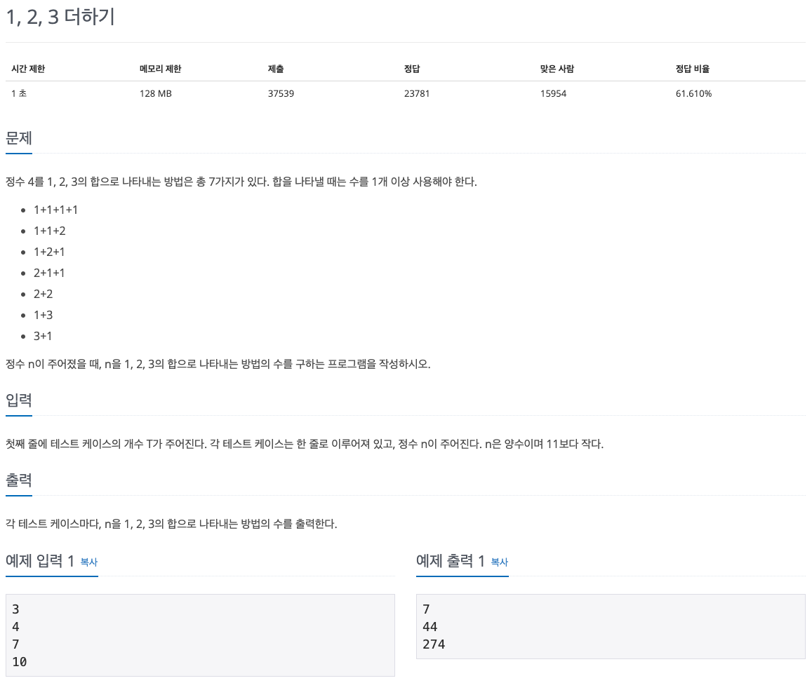

## 문제 파악

[1, 2, 3 더하기 문제 링크](https://www.acmicpc.net/problem/9095){:target="_blank"}

1, 2, 3의 합으로 나타내는 방법에는 순서가 다른 것도 다른 방법으로 취급한다.  
또한, 수는 총 1개 이상이므로, 자기 자신만 존재하는 것도 하나의 방법으로 취급해야 함을 유의한다.

## 문제 풀이

입력된 정수가 커질수록 합으로 나타내는 경우의 수는 기하급수적으로 커진다.
또한, 그 방법을 수식으로 표현할 방법조차 아주 복잡하거나 불가능하다.
이때, 유용한 방법이 **동적 계획법**이다.

[동적 계획법(Dynamic Programming)][동적 계획법]{:target="_blank"}은 큰 문제를 작은 문제로 쪼개어, 작은 문제의 해답을 이용해 큰 문제를 해결하는 방법이다.
이때, 작은 문제들의 해답으로 큰 문제의 해답을 구할 수 있는 반복 구조여야 적용이 가능하다.
또한, **작은 문제들의 해답을 미리 저장하고, 동일한 해답이 다시 필요한 경우 재활용**함으로써, 속도를 최적화할 수 있다.

주어진 문제가 동적 계획법을 이용할 수 있는지, 정수 4를 1, 2, 3의 합으로 나타내는 방법에 대한 예시를 분석해보자.

- 맨 앞에 수를 하나 두면, **나머지 부분은 주어진 수에 앞에 둔 수를 빼고 동일한 방법을 적용**해 구성할 수 있다.
- 맨 앞에 올 수 있는 수는 **1, 2, 3의 3가지 수**뿐이다.

예시에 적용해보면, 다음과 같다.  
맨 앞에 1이 있으면, 나머지 부분은 4에서 1을 뺀 3에 동일한 방법을 적용할 수 있다.  
맨 앞에 3이 있으면, 나머지 부분은 4에서 3을 뺀 1에 동일한 방법을 적용할 수 있다.

이는 **동일한 문제가 작은 수에 대해 반복**적인 것을 알 수 있다.
주어진 수는 작은 수들의 문제로 쪼개지고, 그 작은 수들은 또 작은 수들의 문제로 쪼개지고, 결국은 최소에 해당하는 초기값까지 쪼개질 것이다.
우리는 초기값을 쉽게 구할 수 있으므로, 거꾸로 작은 수부터 해답을 찾아가면, 최종적으로 주어진 수의 해답을 구할 수 있을 것이다.

이때, 구했던 작은 문제의 해답이 다른 문제에서 필요할 때 다시 구하게 되면, 시간 낭비가 되므로 **해답을 저장해두고 재활용**하도록 한다.
이를 통해 반복적으로 계산하던 방식에 비해 **빠른 속도 향상**을 이룰 수 있다.

해답 저장을 위해서 **해시 테이블**인 `Dictionary`를 이용한다.
`Dictionary`의 키로 구하려는 수를 이용하면, 해당 수(키)에 대한 즉각적인 값을 얻을 수 있으므로 아주 빠르게 얻을 수 있다.
이에 비해 `List`의 인덱스를 구하려는 수로 이용하면, 사용하지 않는 공간이 많이 낭비될 수 있다.

주어진 수를 `n`이라 하면, 합으로 나타내는 경우의 수 `count(n)`는 맨 앞에 각각 1, 2, 3을 놓았을 때, 나머지 부분의 경우의 수들의 합이라 할 수 있다.
맨 앞에 1을 놓았을 때는 n에서 1을 뺀 나머지의 경우의 수이므로 `count(n - 1)`이고, 나머지 수에 대해서는 각각 `count(n - 2)`, `count(n - 3)`가 된다.

이것은, `count(n) = count(n - 1) + count(n - 2) + count(n - 3), n > 3`와 같이 일반화할 수 있다.

위의 식에서 `n`은 3보다 커야, 주어진 수가 양수라는 조건에 맞게 해답을 구할 수 있다.
`n <= 3`인 1, 2, 3인 경우는 직접 구해서 미리 저장해 이용하도록 한다.

`n <= 3`인 경우에 대해서, `count(1) = 1, count(2) = 2, count(3) = 4`와 같이 구할 수 있다.

동적 계획법 문제는 반복 구조이므로 [재귀 함수][재귀]{:target="_blank"}를 통해 일반식을 쉽게 구현할 수 있다.
이때, **해답을 저장하는 처리와 이미 해답이 존재하는 경우 그대로 반환하는 처리를 잊지 말자**.
그렇지 않으면, 무한 재귀 호출이 되어 프로그램이 종료되는 것을 경험할 수 있다.

## 풀이 소스

문제 풀이 환경: Python 3.7


ns = [int(input()) for _ in range(int(input()))]

counts = {1: 1, 2: 2, 3: 4}
def count(i):
  if i in counts:
    return counts[i]
  counts[i] = count(i - 1) + count(i - 2) + count(i - 3)
  return counts[i]

for n in ns:
  print(count(n))


[동적 계획법]: https://ko.wikipedia.org/wiki/%EB%8F%99%EC%A0%81_%EA%B3%84%ED%9A%8D%EB%B2%95
[재귀]: https://ko.wikipedia.org/wiki/%EC%9E%AC%EA%B7%80_(%EC%BB%B4%ED%93%A8%ED%84%B0_%EA%B3%BC%ED%95%99)
