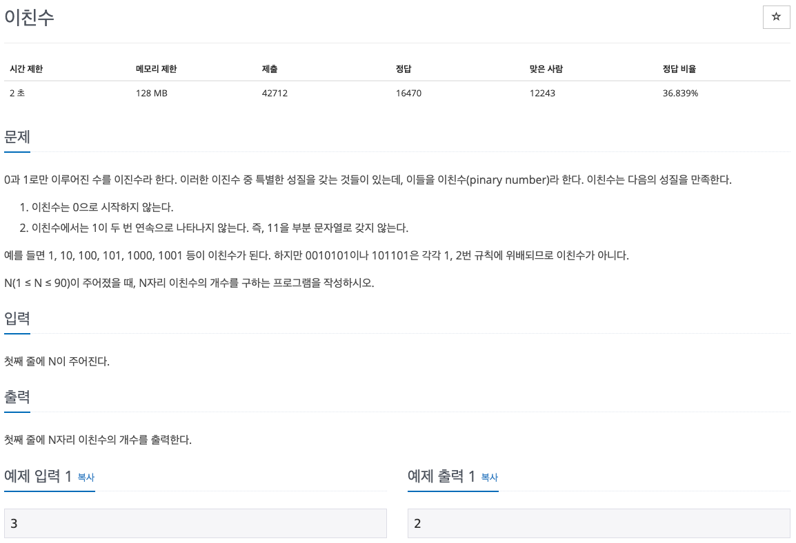

## 문제 파악

[이친수 문제 링크](https://www.acmicpc.net/problem/2193){:target="_blank"}

이친수의 성질에 유의해 개수를 구하도록 한다.

## 문제 풀이

이친수의 개수를 구하기 위해 모든 이진수에 대해 해당 성질을 만족하는지 검사를 하게 되면, 정말 많은 시간이 걸릴 수 있다.
따라서, 다른 방법을 생각해내야 하는데, 몇 가지 예시를 분석해보니 [동적 계획법(Dynamic Programming)][동적 계획법]{:target="_blank"}을 적용할 수 있었다.

주어진 입력이 5인 경우를 예로 들어 모든 경우를 찾아보면 다음과 같다.  
`100000 100001 100010 100100 100101 101000 101001 101010`

이 중 `100000 100001 100010 100100 100101`은 입력이 4인 경우의 수와 같다.  
그 이유는 앞에서 세번째 수가 0이라 했을 때(`100***`), 입력이 4인 경우의 수(`10***`)를 구하는 것과 같기 때문이다.

비슷하게 나머지 `101000 101001 101010`은 입력이 3인 경우의 수와 같다.  
그 이유는 앞에서 세번째 수가 1이라 했을 때(네번째 수는 0만 가능하므로, `1010**`), 입력이 3인 경우의 수(`10**`)를 구하는 것과 같기 때문이다.

따라서, 입력 `n`에 대한 이친수의 개수는 다음과 같은 공식을 구할 수 있다.  
`count(n) = count(n-1) + count(n-2)`

이렇게 재귀식이 구해지면, 동적 계획법으로 해결하기 적합하고, 그 구현 또한 쉬워진다.  
`n`이 `0 또는 1`인 경우의 초기값을 구해놓고, `2`부터 `n`까지 증가시키며 이친수의 개수를 구하면 된다.

## 풀이 소스

문제 풀이 환경: Python 3.7


n = int(input())

counts = [0, 1]
for i in range(2, n + 1):
  counts.append(counts[i - 1] + counts[i - 2])

print(counts[-1])


[동적 계획법]: https://ko.wikipedia.org/wiki/%EB%8F%99%EC%A0%81_%EA%B3%84%ED%9A%8D%EB%B2%95
