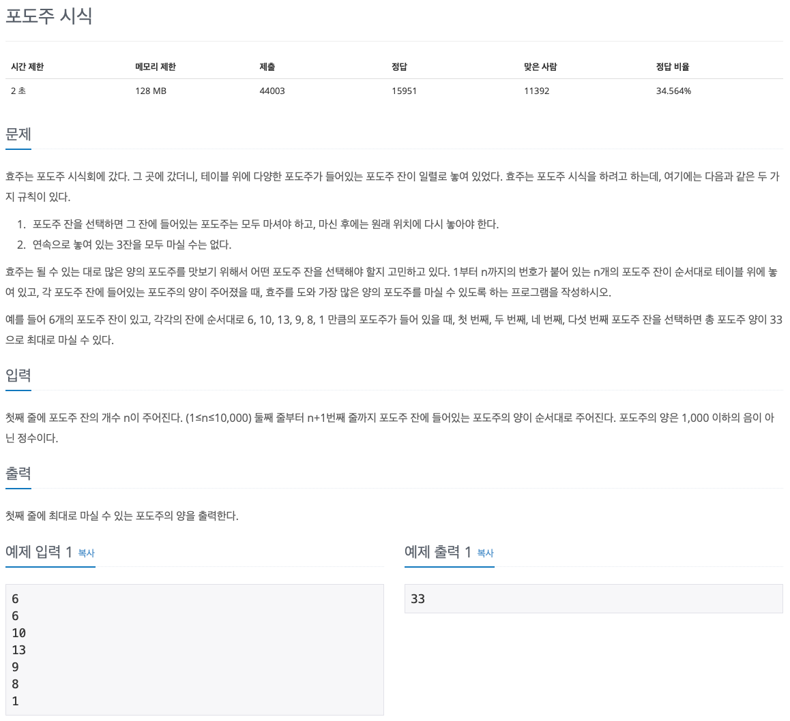

## 문제 파악

[포도주 시식 문제 링크](https://www.acmicpc.net/problem/2156){:target="_blank"}

연속으로 3잔을 선택하지 않고, 마신 포도주 양이 최대가 되도록 포도주 잔을 선택했을 때, 포도주 양을 구하는 문제이다.  
연속 1잔, 2잔까지는 허용하도록 선택하는 것에 유의해 문제를 푼다.

## 문제 풀이

[동적 계획법(Dynamic Programming)][동적 계획법]{:target="_blank"}을 이용해 포도주의 잔이 적을 때부터 단계적으로 풀어나가면 된다.  
여기서 핵심은 작은 문제에서 어떠한 값들을 기록하며 최종 문제에 도달할 것인지이다.

`i`번째에서 구한 최대 포도주 양을 `max_amount(i)`라 하면, 포도주가 한 잔 추가됐을 때의 최대 포도주 양을 어떻게 구할지 생각해봐야 한다.
일단, 경우의 수가 어떤 것이 있는지 알아보자.

이 문제에서 가장 중요한 규칙은 `"연속으로 놓여 있는 3잔을 모두 마실 수는 없다."`이다.  
이 말은 즉, 연속으로 잔이 놓이지 않도록 경우를 나눠 생각해볼 수 있다.  
이를 **마지막에 연속으로 마신 잔의 수**에 의한 기준으로 다음과 같이 경우를 나눌 수 있다.

- `0`일 때: `i`번째 포도주는 마시지 않으므로, **이전의 최대 포도주 양**에 해당한다.
- `1`일 때: `i`번째 포도주는 마시고, `(i - 1)`번째 포도주는 마시지 않으므로, `(i - 1)`번째에 **마지막에 연속으로 마신 잔의 수가 0일 때**의 최대 포도주 양에 `i`번째 포도주 양을 더한다.
- `2`일 때: `i`, `(i - 1)`번째 포도주를 모두 마시므로, `(i - 1)`번째에 **마지막에 연속으로 마신 잔의 수가 1일 때**의 최대 포도주 양에 `i`번째 포도주 양을 더한다.

여기서 주의할 점은 `0`의 경우에서 **이전의 최대 포도주 양**을 구할 때, `(i - 1)`번째 **최대 포도주 양 중의 최대값**을 구해야 한다는 것이다.
왜냐하면, `i`번째 포도주를 마시지 않으므로 `(i - 1)`번째의 마지막에 연속으로 마신 잔의 수는 무관하기 때문이다.
몇 잔을 마시든 최대 포도주 양만 구하면 된다.

이런 식으로 **마지막에 연속으로 마신 잔의 수에 따른 최대 포도주 양**을 잔의 수에 따라 기록한다.  
최종적으로 마지막 잔에 대해 최대 포도주 양을 구하고, 그 때의 최대 포도주 양 중의 최대값이 정답이 된다.

### Python 입력 방식에 따른 수행 속도 차이

기존에 하던 방식대로 `input()` 함수를 이용해 입력을 처리했더니, `약 436ms`의 속도가 나왔다.
그런데 다른 사람의 수행 속도는 `64ms`로 큰 차이가 있었다.
로직의 차이가 있는지 알았으나 큰 차이가 없었다.

검색 끝에 알게된 사실은 Python으로 알고리즘 풀이를 할 때는 `input()` 함수 대신 `sys` 모듈의 `sys.stdin` 객체를 이용해야 속도가 향상된다는 것이다.
실제로 `sys.stdin` 객체를 이용해 똑같은 로직을 적용하니, 다른 사람과 동일하게 `64ms`의 속도가 나왔다.
이는 `input()` 함수와 `sys` 모듈의 입력 함수들의 로직에 차이가 존재하기 때문인 것 같다.
(자세한 내용은 다양한 의견이 있으므로, 검색을 통해 공부하는 것이 좋을 것 같다.)

`sys.stdin` 객체는 파일의 끝까지 한 번에 입력받는 방식이다.
CLI에서 입력을 완료하기 위해서 마지막에 `EOF(End Of File)` 문자 입력이 필요하다.
`Control(Ctrl) + D` 키로 입력할 수 있다.  
한 줄씩 입력한다면, `sys.stdin.readline()` 함수를 사용하면 된다. 이때는 `EOF` 문자를 입력할 필요가 없다.

이 문제에서는 첫 줄에 입력받는 `n`은 필요하지 않아, 간단히 `input()` 함수를 통해 버리도록 했다.  
또한, `sys.stdin` 객체를 `for` 문에 바로 사용하거나, `map()` 함수로 바로 맵핑할 수도 있다.  
이때, 한 줄마다 `for` 문 로직이 실행된다는 점과 `sys.stdin` 객체를 통해 반환되는 각 문자열은 **개행 문자**를 제거하지 않는다는 점에 주의하도록 한다.

다음과 같이 입력받은 대로 출력하는 코드를 실행시켜보면, 개행 문자가 포함되어 있는 것을 확인할 수 있다.


import sys
for i in sys.stdin:
  print(i)


결과를 보면, 3, 6번째 줄에 개행 문자가 포함되어 있어, 개행이 한 번 더 일어난다.


Hello
Hello

World!
World!
 


## 풀이 소스

문제 풀이 환경: Python 3.7


import sys

input()
amounts = map(int, sys.stdin)

max_amounts = (0, 0, 0)
for amount in amounts:
  max_amounts = (
    max(max_amounts),
    max_amounts[0] + amount,
    max_amounts[1] + amount
  )

print(max(max_amounts))


[동적 계획법]: https://ko.wikipedia.org/wiki/%EB%8F%99%EC%A0%81_%EA%B3%84%ED%9A%8D%EB%B2%95
