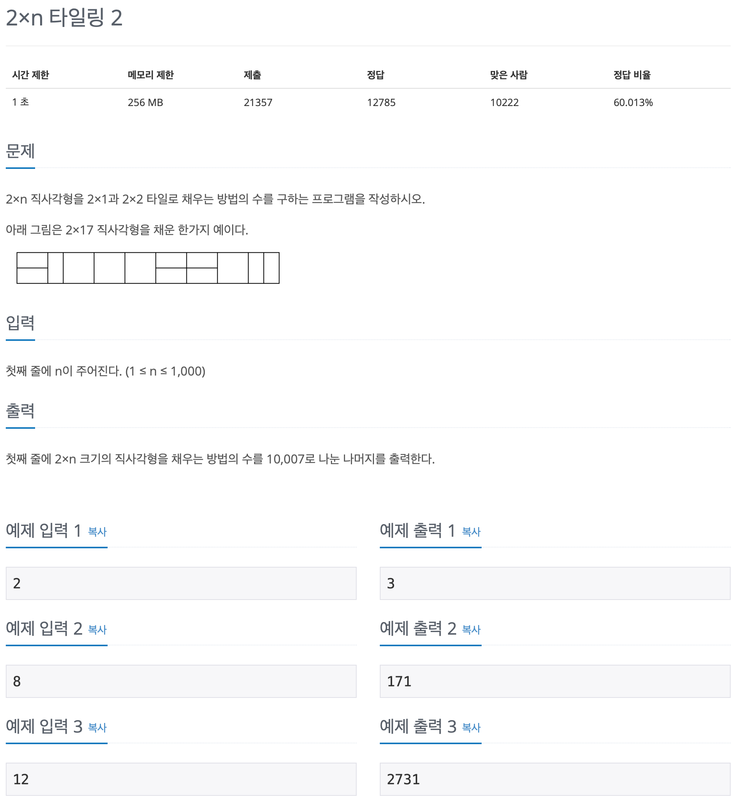
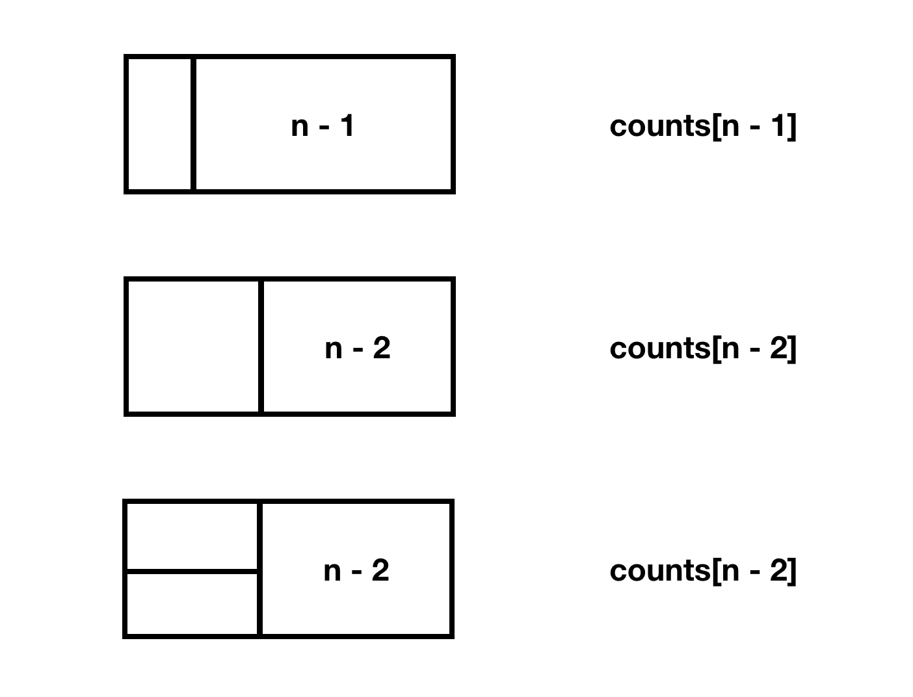

## 문제 파악

[2×n 타일링 2 문제 링크](https://www.acmicpc.net/problem/11727){:target="_blank"}

2xn 직사각형을 채울 때, 2x1, 2x2 타일만 사용할 수 있으며, 2x1은 가로로 채울 수도, 세로로 채울 수도 있다.  
또한, 사용한 개수에 상관없이 채운 모양에 따라 경우의 수가 결정되는 점을 주의해야 한다.

## 문제 풀이

`n`에 따라 반복되는 구조인 것을 확인할 수 있으므로, [동적 계획법(Dynamic Programming)][동적 계획법]{:target="_blank"}을 사용하도록 한다.  
`n`이 작을 때부터 차례대로 구해가며, 최종적으로 입력한 `n`에 대한 방법의 수를 구할 수 있을 것이다.

일단, 필요한 초기값을 생각해보면, 1개의 타일로 채울 수 있는 최대의 너비는 2이므로, `n`이 1일 때와 2일 때의 값은 구해야 한다.
이 경우, 방법의 수가 매우 적으므로 직접 구할 수 있다.

구한 방법의 수를 `counts`에 담는다고 하면, `counts[1] = 1, counts[2] = 3`이 된다.

이제 임의의 수 `n`에 대한 경우의 수, `counts[n]`을 생각해보자.  
다음과 같이 직사각형의 맨 앞부분에 최소의 타일만 사용해 채워보면, **나머지는 부분에 대한 경우의 수**인 것을 알 수 있다.

따라서, 점화식 `counts[n] = counts[n - 1] + counts[n - 2] * 2`를 구할 수 있다.

이처럼 동적 계획법에서는 **반복되는 규칙**을 찾아내는 눈을 기르는 게 중요한 것 같다.

## 풀이 소스

문제 풀이 환경: Python 3.7


n = int(input())

counts = {1: 1, 2: 3}
for i in range(3, n + 1):
  counts[i] = counts[i - 1] + counts[i - 2] * 2

print(counts[n] % 10007)


[동적 계획법]: https://ko.wikipedia.org/wiki/%EB%8F%99%EC%A0%81_%EA%B3%84%ED%9A%8D%EB%B2%95
