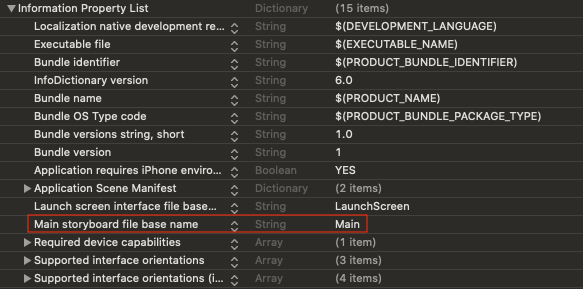
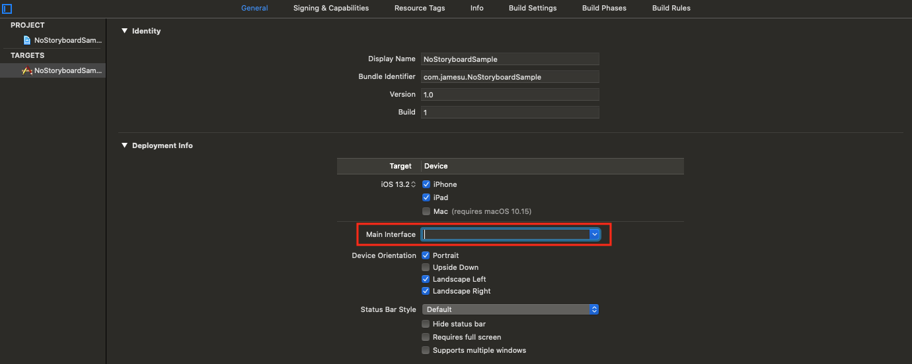
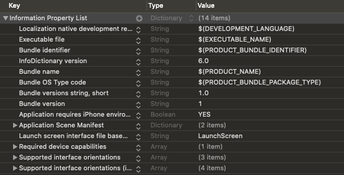
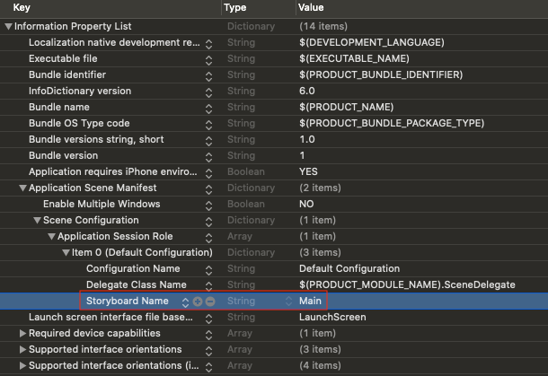
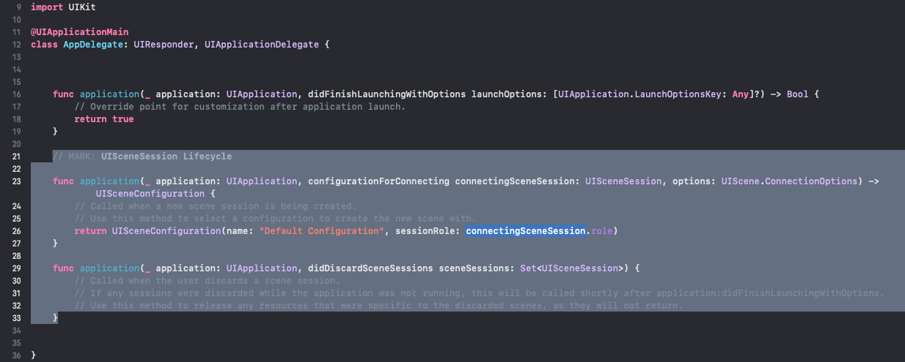
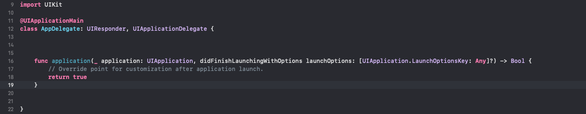
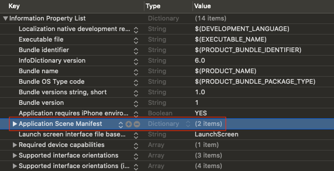
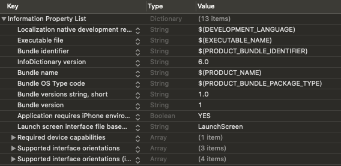

## 개요

뷰를 구성하는 방법은 Code, Storyboard, NIB(XIB) 등 외에 최근에 추가된 SwiftUI까지 다양한 방법이 존재한다.
각 방법은 장단점이 존재해 어떤 것이 Best Practice라고 단정하기 어렵다.
프로젝트 상황에 맞춰 장단점을 고려해 적절히 선택해야 한다.

여기서는 그 중에 **Code 기반 프로젝트**를 시작하기 위해, Xcode에서 프로젝트를 생성하면 **기본적으로 추가되는 스토리보드를 제거하는 방법**을 알려준다.

추가적으로 **Xcode 11**에서 새 프로젝트를 생성한다면, 처음 보는 `SceneDelegate.swift` 파일이 생겼을 것이다.
이는 **iOS 13**을 위해 새로 생긴 `UIWindowSceneDelegate` 프로토콜을 구현한 클래스로, **Scene** 개념을 적용할 수 있게 해준다.
만약, 이전 버전처럼 Scene 개념을 적용할 필요가 없다면 굳이 필요하지 않은 부분이므로, **SceneDelegate를 제거하는 방법**까지 알아보도록 하자.

Scene 개념에 대해 더 자세히 알아보고 싶다면, 다음 링크들을 참고하길 바란다.

- [Managing Your App's Life Cycle]{:target="_blank"}
- [Scenes]{:target="_blank"}

## 스토리보드 제거

스토리보드를 제거하기 위해선 프로젝트가 생성되면서 `Main.storyboard`와 연동된 부분을 끊으면 된다.

### 1. 프로젝트에서 Main 스토리보드 설정을 제거한다. 이때, 프로젝트 설정을 이용하면 편리하다.

{:width="100%"}
{:width="100%"}
{:width="100%"}

위와 같이 프로젝트 설정에서 `Main Interface` 항목의 `Main` 값을 지우면, `Info.plist`에도 반영된다.  
만약, `Info.plist`에 `Main storyboard file base name` 항목이 남아있다면, 제거하도록 한다.

### 2. Xcode 11의 경우, `Info.plist`의 Scene 관련 항목에서 `Storyboard Name` 항목을 제거한다.

{:width="100%"}
{:width="100%"}

### 3. `Main.storyboard` 파일을 삭제한다.

해당 파일은 더 이상 사용하지 않으므로 삭제하도록 한다.

### 4. `ViewController`의 기본 뷰에 배경색을 입히고 `SceneDelegate`에 연동한 후, 앱을 실행시켜 적용한 배경색이 잘 뜨는지 확인한다.


class ViewController: UIViewController {

    override func viewDidLoad() {
        super.viewDidLoad()

        view.backgroundColor = .red
    }
}



class SceneDelegate: UIResponder, UIWindowSceneDelegate {

    var window: UIWindow?

    func scene(_ scene: UIScene, willConnectTo session: UISceneSession, options connectionOptions: UIScene.ConnectionOptions) {
        guard let windowScene = (scene as? UIWindowScene) else { return }
        window = UIWindow(windowScene: windowScene)
        window?.rootViewController = ViewController()
        window?.makeKeyAndVisible()
    }

    ...
}


앱이 실행되면, 빨간색 배경이 보이는 것을 확인할 수 있다.

## SceneDelegate 제거

기존에 `SceneDelegate`에서 `UIWindow`를 설정하는 부분을 예전처럼 `AppDelegate`로 옮기고, Scene 관련 파일과 설정을 제거하면 된다.

### 1. `AppDelegate`에서 Scene 관련 함수 정의부를 제거한다.

{:width="100%"}
{:width="100%"}

### 2. `AppDelegate`에 `UIWindow` 설정 로직을 추가한다.


@UIApplicationMain
class AppDelegate: UIResponder, UIApplicationDelegate {

    var window: UIWindow?

    func application(_ application: UIApplication, didFinishLaunchingWithOptions launchOptions: [UIApplication.LaunchOptionsKey: Any]?) -> Bool {
        window = UIWindow()
        window?.rootViewController = ViewController()
        window?.makeKeyAndVisible()

        return true
    }
}


### 3. `SceneDelegate.swift` 파일을 삭제한다.

해당 파일은 더 이상 사용하지 않으므로 삭제하도록 한다.

### 4. `Info.plist`에서 `Application Scene Manifest` 항목을 통째로 제거한다.

{:width="100%"}
{:width="100%"}

### 5. 앱을 실행시켜 앞서 적용한 배경색이 잘 뜨는지 확인한다.

앱이 실행되고 빨간색 배경이 보이면, 잘 적용된 것이다. 🙂

[Managing Your App's Life Cycle]: https://developer.apple.com/documentation/uikit/app_and_environment/managing_your_app_s_life_cycle
[Scenes]: https://developer.apple.com/documentation/uikit/app_and_environment/scenes
