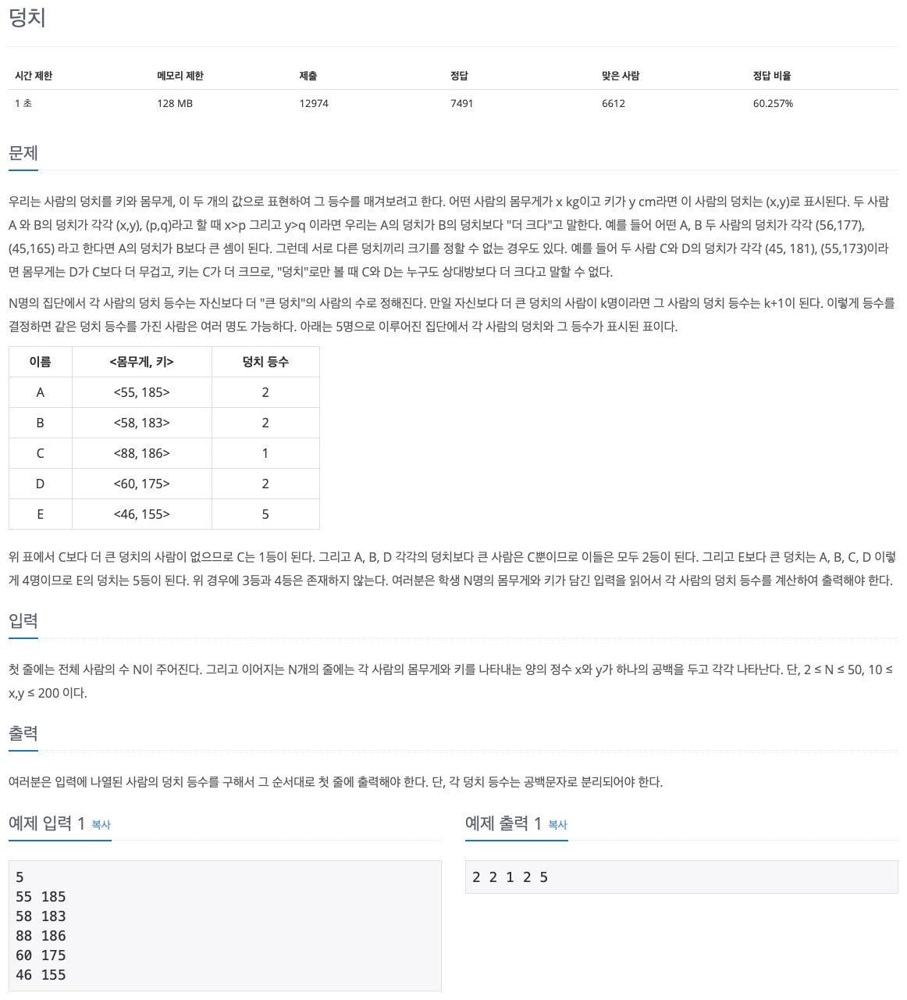

## 문제 파악

[7568 - 덩치 문제 링크](https://www.acmicpc.net/problem/7568){:target="_blank"}

몸무게와 키가 모두 커지야지만 덩치가 더 큰 것이 된다.  
같은 등수가 여러명인 경우, 그만큼 그 다음 등수는 밀린다는 점에 주의한다.

## 문제 풀이

문제에서 등수를 구하기 때문에 정렬을 생각해볼 수 있지만, 단순하게 정렬은 이 문제를 해결해 주지 못한다.
정렬의 기준을 잡기도 모호하고, 동일한 등수에 대한 처리가 필요하기 때문이다.
이 문제의 경우, 자원과 입력의 제한이 크지 않기 때문에 정말 단순한 방법인 [브루트 포스(Brute Force)][브루트 포스]{:target="_blank"} 알고리즘을 적용해 볼 수 있다.

브루트 포스는 **경우의 수를 모두 순회하며 원하는 결과 값을 얻는 방법**을 말한다.
단순하게 순회하는 것이기 때문에 알고리즘을 생각해내기 수월하지만, 자원이 한정되어 있는 경우 문제가 발생할 수 있다.
특히, 입력 범위가 넓은 경우, 시간 제한에 걸릴 수 있으니 다른 알고리즘을 생각해내야 한다.

이런 단점이 있기 때문에 자원 제한이 있는 경우, 다른 알고리즘을 생각해내기 위한 사전 수단으로 이용되기도 한다.
개념적으로는 단순히 경우의 수를 대입해 보면서 알아보는 것이기 때문이다.
그 과정에서 규칙이나 구조를 파악하며 다른 알고리즘을 생각해낼 수 있다.

이 문제에서는 한 명마다 모든 인원을 비교하면서, 덩치가 작은 경우 등수가 밀리도록 했다.
본인을 비교할 때 등수가 밀리지 않도록 주의한다.
이렇게 모든 경우의 수를 비교하면 자연스럽게 덩치에 따라 등수가 밀리므로, 동일한 덩치에 대해서는 같은 등수가 된다.

## 풀이 소스

문제 풀이 환경: Python 3.7


import sys

n = int(input())
xy = [tuple(map(int, l.split())) for l in sys.stdin.readlines()]

rankings = [1] * n
for i in range(len(xy)):
  for x, y in xy:
    if xy[i][0] < x and xy[i][1] < y:
      rankings[i] += 1

print(' '.join(map(str, rankings)))


[브루트 포스]: https://namu.wiki/w/%EB%B8%8C%EB%A3%A8%ED%8A%B8%20%ED%8F%AC%EC%8A%A4
