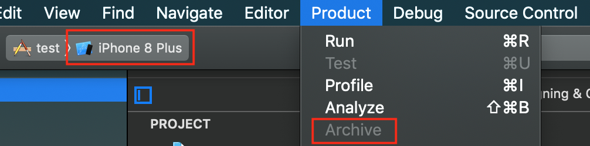
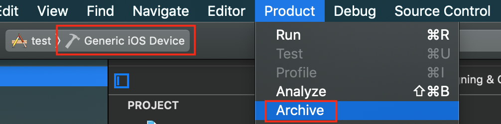

## TL;DR

시뮬레이터를 `Generic iOS Device`로 선택하면, `Archive` 버튼이 활성화된다.

## `Archive` 버튼이 비활성화된 경우

편의상 실제 기기가 아닌 시뮬레이터를 이용해 개발을 하는 경우가 많을 것이라 생각된다.  
그렇게 시뮬레이터를 이용하다가 빌드를 App Store Connect에 업로드 하고 싶을 때,
다음과 같이 `Archive` 버튼이 비활성화되어 있어 업로드를 할 수 없는 상황에 직면할 때가 있다.

이럴 땐 당황하지 말고, 시뮬레이터 부분을 클릭해 `Generic iOS Device`로 변경하자.  
그러면 `Archive` 버튼이 예쁘게 활성화되어 있는 것을 볼 수 있다.

