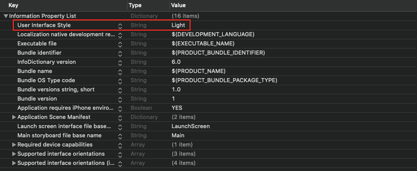

요즘 `Dark Mode`가 대세(?)라 그런지 많은 앱이 그것에 맞춰 디자인 되고 있다.  
하지만, 무조건 그 대세를 따르라는 법은 없다!

`Light Mode`를 선호하는 사람을 위해 밝은(?) 디자인으로 된 앱을 개발한다고 하자.  
그렇게 밝은(?) 배경을 가진 앱을 개발하고 `Dark Mode`에서 앱을 실행해봤는데,
상단의 `Status Bar`가 하얀 글씨로 되어있기 때문에 잘 안 보이는 상황이 발생했다.

그러면, 다음과 같이 뷰 컨트롤러마다 `Status Bar Style`을 지정해 줄 것인가?

이는 매우 수고스러운 일이 될 것이다.

이러한 수고를 피하기 위해 `Default Status Bar Style`을 지정하고 싶다면, `Info.plist` 파일에 들어가보자.  
그리고 아래와 같이 `User Interface Style` 키와 `Light` 값을 추가하도록 하자.  
(실제 코드로는 `UIUserInterfaceStyle` 키를 가진다.)

그러면, 앱의 기본 인터페이스가 밝은(?) 스타일이 되면서, `Dark Mode`가 아닌 `Light Mode`로 설정된다.  
만약, 특정 뷰 컨트롤러만 `Light Status Bar`를 갖고 싶다면,
첫 번째 그림과 같이 뷰 컨트롤러에서 `.darkContent`가 아닌 `.lightContent`를 반환하도록 하면 된다.

참고로 `User Interface Style`를 `Light`로 고정하면, 키보드 및 뷰들의 기본 배경색 등이 모두 `Light` 스타일이 된다.
`Dark Mode`로 설정 시, 모두 변경되는 것과 같은 원리이다.
