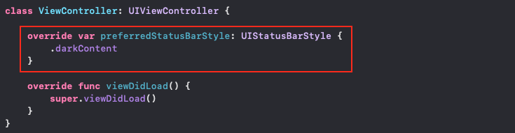

## TL;DR

- `Info.plist`에서 `User Interface Style` 키에 `Light` 값을 설정한다.

- 특정 화면만 다르게 설정하고 싶다면, `preferredStatusBarStyle` 프로퍼티를 이용한다.

- 인터페이스 스타일과 상태바 스타일은 반대의 값을 사용한다.  
(예: 인터페이스 스타일이 `Dark`이면, 상태바 스타일은 `Light Content`이다.)

- 키보드 및 특정 뷰의 기본 배경색 등은 인터페이스 스타일을 따라간다.

## 기본 상태바 스타일 바꾸기

요즘 `Dark Mode`가 대세(?)라 그런지 많은 앱이 그것에 맞춰 디자인 되고 있다.  
하지만, 무조건 그 대세를 따르라는 법은 없다!

`Light Mode`를 선호하는 사람을 위해 밝은(?) 디자인으로 된 앱을 개발한다고 하자.  
그렇게 밝은(?) 디자인의 앱을 개발하고 `Dark Mode`에서 앱을 실행했는데,
상단의 `Status Bar`가 하얀 글씨로 되어있기 때문에 잘 안 보이는 상황이 발생했다.

그러면, 다음과 같이 뷰 컨트롤러마다 `Status Bar Style`을 지정해 줄 것인가?


class ViewController: UIViewController {

    override var preferredStatusBarStyle: UIStatusBarStyle {
        .darkContent
    }

    override func viewDidLoad() {
        super.viewDidLoad()
    }
}


이는 매우 수고스러운 일이 될 것이다.

이러한 수고를 피하기 위해 `Default Status Bar Style`을 지정하고 싶다면, `Info.plist` 파일에 들어가보자.  
그리고 아래와 같이 `User Interface Style` 키를 추가해 `Light` 값을 설정하도록 하자.  
(실제 `XML` 코드로는 `UIUserInterfaceStyle` 키를 가진다.)

그러면 앱의 기본 인터페이스가 밝은(?) 스타일이 되면서, `Dark Mode`가 아닌 `Light Mode`로 설정된다.  
만약, 특정 뷰 컨트롤러만 `Light Status Bar`를 갖고 싶다면,
첫 번째 코드에서 뷰 컨트롤러의 `preferredStatusBarStyle` 프로퍼티가 `.darkContent`가 아닌 `.lightContent`를 반환하도록 작성하면 된다.  
인터페이스 스타일이 `Dark`일 때, 상태바의 스타일은 `Light Content`로 반대의 색을 가진다는 것에 주의하자.

참고로 `User Interface Style`를 `Light`로 설정하면, 키보드 및 특정 뷰의 기본 배경색 등이 모두 `Light` 스타일이 된다.
마찬가지로 `Dark`로 설정 시, 모두 `Dark` 스타일로 고정된다.
