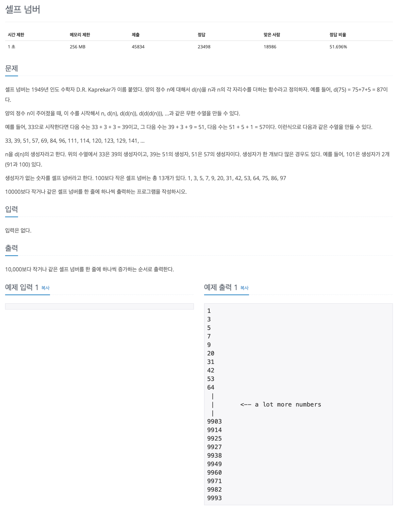

## 문제 파악

[셀프 넘버 문제 링크](https://www.acmicpc.net/problem/4673){:target="_blank"}

생성자의 개수와 관계없이 생성자가 없는 숫자가 셀프 넘버이므로, 생성자의 존재 여부만 확인하면 된다.  
생성자의 존재 여부를 어떻게 해결할 것인지에 초점을 맞춘다.

## 문제 풀이

여러 숫자에 대해 각 숫자가 생성자를 가지는지 아닌지 판단하는 것은 매우 많은 계산량을 필요로 하게 된다.  
그렇다면, 반대로 생각해보자.

특정 숫자를 생성자로 가지는 다음 숫자는 문제에서 정의한 `d(n)` 함수를 통해 쉽게 구할 수 있을 것이다.  
또한, 반복적으로 해당 함수를 적용하면, 계속해서 해당 생성자를 가지는 숫자들을 구할 수 있다.  
**셀프 넘버의 정의가 생성자가 없는 숫자이므로, 생성자를 가지는 숫자들은 셀프 넘버가 아닌 것이다**.  
위의 방법으로 셀프 넘버가 아닌 숫자들을 빠르고 쉽게 구할 수 있다.

그리고 이 문제처럼 범위가 주어진다면, 소수를 구할 때 체를 걸러내는 방식인 [에라토스테네스의 체(Sieve of Eratosthenes)][에라토스테네스의 체]{:target="_blank"}의
원리를 적용하기에 적합하다.  
주어진 범위에 대해 생성자로부터 **셀프 넘버가 아닌 숫자들을 걸러낸다면, 결국에는 셀프 넘버만 남게 된다**.  
(에라토스테네스의 체로 소수를 구하는 방법은 [Codeforces 문제 풀이: 230B - T-primes][Codeforces 문제 풀이: 230B - T-primes]{:target="_blank"} 포스트에서 확인할 수 있다.)

위와 같은 원리로, 10001개 요소를 가지는 배열 `sn`을 정의하고, 셀프 넘버만 남기도록 체를 거른다.  
그리고 다시 순회하며 셀프 넘버만 출력하면 된다.  
참고로 10001개 요소를 선언한 이유는 0을 제외한 숫자 맵핑을 쉽게 하기 위해서다.

## 풀이 소스

문제 풀이 환경: Python 3.7


def d(n):
  return n + sum(i for i in map(int, str(n)))

n = 10000
sn = [1] * (n + 1)
for i in range(n):
  dn = d(i + 1)
  if dn <= n:
    sn[d(i + 1)] = 0

for i in range(n):
  if sn[i + 1]:
    print(i + 1)


[에라토스테네스의 체]: https://ko.wikipedia.org/wiki/%EC%97%90%EB%9D%BC%ED%86%A0%EC%8A%A4%ED%85%8C%EB%84%A4%EC%8A%A4%EC%9D%98_%EC%B2%B4
[Codeforces 문제 풀이: 230B - T-primes]: https://jamesu.dev/posts/2019/12/23/codeforces-problem-solving-230b-t-primes
