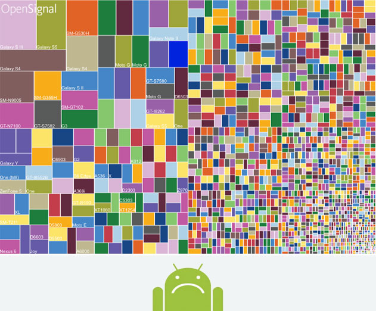
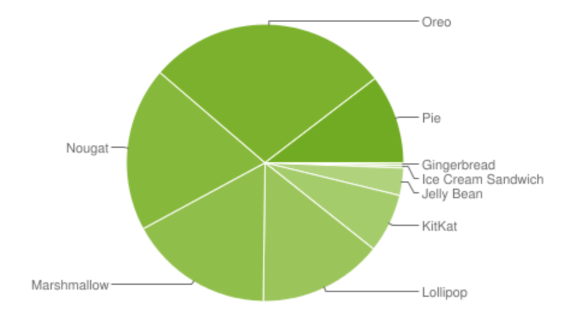

## TL;DR

- 이미 알고 있었던 것처럼 **안드로이드의 파편화**는 끔찍했다.  
하지만, 더 끔찍했던 것은 **앱의 완성도**.

- `NPE` 방지는 기본 중의 기본! (특히, 모바일 개발에서는 필수!)

- `SwipeRefreshLayout` 안에 `RecyclerView`가 연속으로 중첩된 경우,  
`nestedScrollingEnabled` 옵션을 이용해 새로고침 동작이 중복되지 않도록 할 수 있다.

## 끔찍한 안드로이드의 파편화

*내 표정도 이와 같다.*

오늘 하루 날을 잡아 사내에서 개발한 안드로이드 앱 하나의 테스트를 진행하고 이슈를 처리하는 시간을 가졌다.
내가 직접 만든 앱이었다면, 알 수 없는 자신감으로 버그가 적을 것이라 예상할 수 있지만, 인수인계 받은 앱이라 정상 작동을 확신하지 못했다.
그렇게 OS 버전과 제조사를 고려해 Android 4.4 ~ 9.0 버전과 삼성 및 LG의 핸드폰을 대상으로 테스트를 진행했다.

버전 이슈가 없길 희망했지만, 결과는 희망을 배신했다.  
아무래도 이렇게 다양한 버전과 기기를 대상으로 테스트한 것은 처음이라 그런지 OS 버전에 따른 이슈가 존재했다.
특히, 4.4 버전의 이슈가 대부분이었고, 다행히 다른 버전에서는 큰 이슈가 없었다.

*안드로이드 OS 버전 파편화*

사전에 최소 OS 버전을 무엇으로 할 지 조사를 한 결과, **약 95% 이상을 커버하려면 4.4 버전(KitKat) 이상**이어야 했다.
물론, 4.4 버전을 사용하는 사용자는 매우 적을 것이라 생각하지만, 업무 도메인 특성상 옛날 폰을 사용하는 사용자가 존재할 가능성이 있기 때문이다.
아무튼 4.4 버전에서만 발생하는 이슈가 많아 5.0 버전부터 지원할 지 논의할 예정이다.

이처럼 안드로이드는 iOS에 비해 버전 파편화와 기기 파편화가 심해서 예상했던 결과였다.
(기기 파편화를 고려해 여러 제조사를 테스트하고 싶었으나 해당 테스트 센터에서는 준비된 기기가 없었다.)

정말 끔찍했던 것은 파편화의 문제가 아니라 **앱의 완성도**였다.  
개인적으로 앱을 개발할 때 앱의 완성도를 신경쓰는 편이다.
iOS 버전과의 **동작의 일관성**을 당연하고, 특별한 경우를 제외하고는 **UI의 일관성**도 유지하려고 한다.
그런데 여기서 당연하게 되어야 할 동작의 일관성에 버그가 꽤나 발견됐다.
앞서 개발 후 보유한 기기를 토대로 테스트를 진행했는데도 버그가 존재한 채로 출시한 것이다.
요구사항에 대한 기본적인 테스트도 진행하지 않으며 개발한 것이 눈에 보였다.
(중요한 요구사항 일부가 정상적으로 반영되지 않았다.)

이제는 인수인계를 받은 앱이기 때문에 지금부터 발생하는 버그는 내 책임이 될 것이다.  
나도 누군가에게 내가 받은 느낌을 주지 않도록 앱의 완성도를 끌어 올리는데 더욱 노력해야겠다. 💪

## `NPE` 방지를 놓치는 실수는 하지 말자

앞서 말한 버그 중 하나는 개발자라면 누구나 맞이한 적이 있는 `Null Pointer Exception (이하 NPE)`였다.

`NPE`는 런타임 에러 중 하나로, **메모리에 할당되지 않은 주소에 접근을 시도한 경우 발생하는 예외**이다.  
서버 개발이라면, 공통 예외 처리를 통해 서버가 종료되지 않고 에러를 반환하는 식의 처리가 가능하다.
하지만, **모바일 개발에서는 예외 처리를 놓치면 앱이 강제 종료(Crash)**되기 때문에 매우 치명적이다.
사용하던 앱이 갑자기 알 수 없이 꺼진다면 누구라도 쓰고 싶지 않을 것이다.
그래서 서버 개발에서도 중요하겠지만, 특히 모바일 개발에서 예외 처리는 너무 중요한 부분이다.

그 중에서도 `NPE`는 놓치기 쉬운 예외이다.  
너무나 당연하게 주소에 값이 할당되어 있다고 생각하고 문법을 작성하면, 어느 순간 맞이할 수 있을 것이다.
개발자가 예상할 수 있는 예외는 해당 부분에 예외 처리를 하면 되지만,
`NPE`는 기본 문법의 실수로 발생하는 예외이기 때문에 더욱 주의가 필요하다.

위에서 발생한 버그는 앱에서 로그인한 후에 처음으로 맞이하는 화면에서 간헐적으로 발생하던 버그이다.
나라도 로그인하자마자 앱이 꺼진다면 어이가 없을 것이다.
기존에 발견되지 않은 이유는 기기와 OS 버전에 따라 발생했던 버그라 우연히 발견되지 않았다.
역시나 안드로이드는 파편화에 대한 테스트 진행이 필수인 것 같다.

앞으로 나도 더 꼼꼼하게 놓치지 않고 `NPE` 예외 처리를 해야겠다.
(욕먹기 싫다면 🙄)

## 새로고침 동작이 엉뚱한 부분에서 시작되는 경우

발견한 또 다른 버그는 UI 이슈였다.  
`RecyclerView`를 사용할 때, **당겨서 새로고침** 동작을 위해 `SwipeRefreshLayout`를 사용했다.
그런데, `RecyclerView` 안의 항목 내부에도 `RecyclerView`를 사용해서 중첩된 구조였다.
새로고침 동작은 가장 외부에 있는 `RecyclerView`를 당겨서 수행하고 싶었지만,
저 아래로 스크롤한 후에 항목 내부의 `RecyclerView`를 당기는 경우에도 새로고침 동작이 수행되는 것이었다.

그래서 알아본 결과, 항목 내부의 `RecyclerView`에 `nestedScrollingEnabled`를 `false`로 설정하면
외부의 `RecyclerView`에 대해서만 새로고침 동작이 작동하게 된다.

참고로 해당 옵션은 `XML`에서도 설정할 수 있지만, 4.4 버전을 지원하기 위해서는 `XML`이 아닌 코드로 설정해야 한다.  
`recyclerView.setNestedScrollingEnabled(false)`와 같이 말이다.

iOS 개발이 메인이지만, 안드로이드 개발 경험도 점점 쌓이고 있어 재밌는 것 같다. 😂
