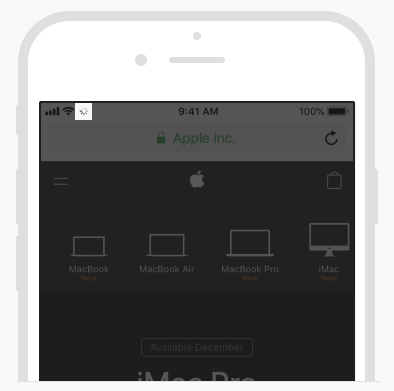

## TL;DR

- 이제 `Network Activity Indicator`를 보여줄 필요가 없다.

## `Network Activity Indicator`란? 🤔

iOS 앱에서 네트워크 연결이 길어지는 경우, `Network Activity Indicator`라는 **네트워크 연결중 표시를 위한 UI**가 있다.

*상태바 좌측에서 확인할 수 있다.*

이것을 본 사람도 있고 아닌 사람도 있을 것이다.
왜냐하면, 화면 모양에 따라 보여지는 경우가 있고 아닌 경우도 있기 때문이다.
또한, 앱 개발자가 이것을 보여지도록 처리했는지에 따라 앱을 사용하는 내내 볼 수도 있고 못 볼 수도 있다.
이것은 순전히 개발자에게 달려있다.

보여 줄 수 있는 화면이라면, 보여주는 것이 사용자를 위한 배려라 생각들지 않는가?  
다음과 같이 애플의 **Human Interface Guidelines(이하 HIG)** 문서의
[Progress Indicators 내용][HIG Progress Indicators]{:target="_blank"}에 따르면,
`Network Activity Indicator`는 네트워크 연결이 길어지는 경우에 보여주고,
통신이 빠른 동작에는 보여주지 말라는 말이 있다.

> **Show this indicator only for network operations lasting more than a few seconds.**  
> Don’t display the indicator for quick network operations
> because it’s likely to disappear before anyone notices its presence
> or realizes what it’s meant to communicate.

앱을 만들 때마다 이것을 신경 쓰는 것은 매우 귀찮은 일이 될 수도 있다.

## 구현 할지 말지 더 이상 신경쓰지 않아도 된다! 😏

[동일한 페이지][HIG Progress Indicators]{:target="_blank"}의 바로 윗 부분에
**"iOS 13 이상이나 edge-to-edge 디스플레이의 기기에서는 더 이상 해당 UI를 제공하지 않는다"**는 내용도 있다.

> The network activity indicator is deprecated in iOS 13 and on devices with edge-to-edge displays.

대체하는 API가 나온 것이 아닌 완전한 **Deprecated**이다.
앞으로 애플에서도 해당 UI에 대해 생각하지 않겠다는 것이다.
그 대신 자주 사용하는 로딩중 표시를 위한 UI인 `Activity Indicator`를 사용하면 된다.

사라질 기능이니 앞으로 새로 개발하거나 개선하는 앱에서는 굳이 `Network Activity Indicator`를 사용하지 않아도 된다.
아주 미세한 짐 하나를 덜어낸 것 같다. 🙄

[HIG Progress Indicators]: https://developer.apple.com/design/human-interface-guidelines/ios/controls/progress-indicators/
