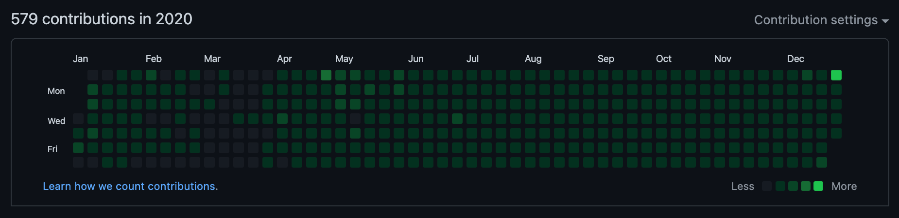

## TL;DR

- GitHub 연속 일일 커밋은 나름 성공적으로 `232`일째 진행중이다.
- TIL은 `개발 일기`로 생각하고 많이 분발해 작성하자.
- 작년의 프로젝트는 모두 만족스럽고 재밌었다.
  - Objective-C to Swift 포팅
  - iOS/Android 앱 디자인 리뉴얼
  - 사내 iOS 공통 라이브러리 개발
- 올해의 프로젝트에 iOS 개발 트렌드를 반영하자.
  - `RxSwift`
  - iOS 디자인 패턴: `MVVM`
  - `CI/CD`
- iOS에 집중해 `깊이가 깊은 iOS 개발자`가 되자.

## Today I Committed

{:width="100%"}
*GitHub Contributions in 2020*

GitHub를 사용하면서 개인적인 성취감을 위해 일일 커밋을 4월 초부터 시작했다.
그러다 4월 11일에 한 번 구멍이 생기고, 5월 13일에 한 번 더 구멍이 생기면서...
2020년의 연속 일일 커밋은 아쉽게 **232일째**로 끝이 났다.

일일 커밋은 하루 한 줄이라도 코드를 작성하면서 그 감을 잃지 않고 꾸준함을 유지하려는 목적으로 시작했다.
약속이 있는 날, 바쁜 날 등처럼 일일 커밋을 하기 힘든 날에도 계속 신경써서 연속 일일 커밋을 유지한 나에게 작은 칭찬을 하고 싶다.

이제는 일일 커밋이 매일 떠오를 정도로 습관이 몸에 배어 2021년에도 실수하지만 않으면 연속 일일 커밋을 할 수 있을 것 같다.
2021년에는 4월 11일, 5월 13일과 같은 구멍이 발생하지 않도록 조심하며, 꾸준히 신기록을 갱신하고 싶다.  
2021년의 Contributions에는 초록색으로 가득차길 바라며, 오늘도 나는 커밋 잔디를 심는다... 🌱

## Today I Learned, but...

5월에는 **TIL**에 관심이 생기면서 TIL을 일일 커밋 겸 작성하려고 했으나... 매일 글을 쓰는 게 나에게는 너무 어려웠다.
**일일 배움**이라는 마음가짐으로 TIL을 시작했기에 무엇이라도 배운 것이 있을 때 그것에 대해 작성했고, 생각보다 소재 고갈이 잦았다.
(물론, 배운 것이 있었지만 글로 안 쓴 것도 많다... 🤔)

TIL 작성은 **6월 이후부터 12월이 되기 전까지는 전무**했고, 일일 커밋은 주로 원래 하던 문제 풀이를 통해 진행했다.
아무래도 글쓰기가 익숙하지 않아서 그런지 (많이 어렵지 않은) 문제 풀이가 글쓰기보다는 쉬웠다.
글을 고치는 게 잦아서 글쓰기에 많은 시간이 들어가고, 새로운 문장을 생각해내는 것도 어려웠다.

사실 내 TIL의 원래 취지는 **기록**하는 것에 초점이 맞춰 있는 **개발 일기**에 가깝다.
그 초점에 맞추지 않고 TIL을 작성하다 보니 배가 산으로 간 것 같다.
"정성 가득 길게 글을 쓰는 것보다는 무엇을 배웠는 지를 기록하는 것이 목표이므로 앞으로는 그 부담을 덜고 작성했으면 좋겠다."
라고 2021년의 나에게 말하고 싶다. 🙄

## Today I Worked

재작년에는 서버와 웹 프론트엔드 유지보수가 주 업무였다면, 작년은 모바일 업무에 집중할 수 있었던 해였다.
모바일 개발자로 입사했기에 모바일 업무에 집중하는 것이 맞지만 어찌저찌 다른 업무를 맡았어서 모바일 업무만 하고 싶다고 강력 어필 했었다.
결과적으로 4분기에 서버를 잠시 했었지만, 모바일에 집중 할 수 있어 좋았다.

작년의 대표적인 모바일 성과로는 **Objective-C to Swift 포팅, iOS/Android 앱 디자인 리뉴얼, 사내 iOS 공통 라이브러리 개발**이 있다.
Swift 포팅은 자진해서 진행했던 프로젝트이고, 앱 디자인 리뉴얼은 전면 개편이라 내부 구조도 바꿔가며 손이 많이 갔다.
마지막으로 사내 iOS 공통 라이브러리 개발은 자주 쓰는 뷰나 기능 등을 모아 라이브러리로 만드는 작업으로 현재 진행형이다.

### Objective-C to Swift 포팅

사내에 Objective-C로 되어 있는 앱들이 있어 유지보수가 매우 힘들었고, 그리하여 효율화를 위해 자진해서 Swift 포팅 프로젝트를 추진했다.
앱 하나에 대해서만 진행했으며, 기존 앱에 요구사항이 덜 적용된 부분도 있어 전체적으로 품질 향상의 효과도 있었다.
디자인 개선도 같이 진행해서 Swift 포팅을 하며 새로 만드는 것이 오히려 더 수월했다.
야근을 많이 해서 힘들었지만, **두 언어의 차이를 느끼며 여러가지를 비교할 기회가 되어 아주 만족스러웠던 프로젝트였다**. 🙂

### iOS/Android 앱 디자인 리뉴얼

디자인 리뉴얼은 앱 하나의 디자인 전체를 개편하는 작업이라 거의 모든 소스를 건드려야 했다.
그 과정에서 내부 구조도 많이 개선시키면서 두 플랫폼의 요구사항이 맞지 않는 것을 맞춰가는 작업까지 진행했다.
iOS와 안드로이드 모두를 맡다 보니 힘들었지만,
**내부 구조를 분석하면서 어떻게 하면 효율적으로 구조화 할 수 있을지 두 플랫폼 모두에 대해 고민 할 수 있어 큰 경험이 됐다**.
그래도 앞으로는 주 업무는 iOS만 하고 싶다. 🤔

### 사내 iOS 공통 라이브러리 개발

사내 iOS 공통 라이브러리 개발은 새 앱을 개발하거나 기존 앱을 개선할 때 효율적으로 프로젝트를 진행하고자 추진한 프로젝트다.
앞으로 만들 새 앱에 대한 일관성 있는 디자인과 기능을 적용하고자 디자인 팀과 빈번하게 의사소통하며 요구사항을 정리했다.
커스터마이징도 가능하게 만들면서 공통적인 부분만 추출해 구현하고자 노력했다.
**앱을 만드는 관점과 달리 라이브러리를 만드는 관점에서 구현을 하다보니 두 관점이 많이 다르다는 것을 느낄 수 있었다**. 🙂

## Tomorrow I will Learn

여러 개발 분야의 트렌드는 모두 빠르게 바뀌고 발전하고 있다.
모바일 개발 트렌드 또한 새로운 것이 생겨나고 기존 것이 발전하고 있는데,
트렌드를 계속 접하고는 있으나 지금까지 제대로 프로젝트에 반영한 적은 없다.

최근에 공부하던 모바일 개발 트렌드 중 특히 iOS 개발 트렌드는 **RxSwift, iOS 디자인 패턴, CI/CD** 등이 있다.
나열한 목록들이 현재 가장 관심이 많고 적용하고 싶은 개발 트렌드에 해당한다.

### RxSwift

[RxSwift](https://github.com/ReactiveX/RxSwift){:target="_blank"}는 비동기 및 이벤트 기반 프로그래밍을 지향하는
[ReactiveX](http://reactivex.io/){:target="_blank"} 프로젝트의 Swift 버전이다.  
ReactiveX 컨셉으로 프로그래밍을 하면 가독성, 안정성, 효율성 등과 같은
다양한 이점을 얻을 수 있어 개인적으로 가장 적용하고 싶은 트렌드이다.
RxSwift를 틈틈이 공부하고 있어,
**추후 사내 iOS 공통 라이브러리에 Rx 버전을 구현하는 것과 실제 프로젝트에 적용하는 것을 생각하고 있다**.
굉장히 재밌는 프로그래밍이 될 것 같아 기대가 된다. 🔥

### iOS 디자인 패턴

iOS 디자인 패턴 또는 iOS 아키텍쳐라고도 불리는 이것은 앱의 코드 구성을 의미한다.
iOS의 기본은 MVC로 되어 있고,
이는 비효율적인 코드 구성을 낳기 때문에 사람들은 새로운 구성을 개발해 내었다.

MVVM, MVP, VIPER, RIBs, ReactorKit 등과 같이 다양한 디자인 패턴이 있지만,
이 중에서 나는 RxSwift와 함께 자주 언급되는 패턴인 **MVVM**을 프로젝트에 적용하고 싶다.
안드로이드에서도 RxJava, RxKotlin과 함께 자주 사용되는 패턴인 만큼 기본이 되는 패턴이라 생각한다.
일단, **MVVM을 실제 프로젝트에 적용 해보는 방향으로 하고 나머지 패턴은 개인적으로 공부하며 고민해봐야겠다**. 🤔

### CI/CD

CI/CD는 Continuous Integration(지속적 통합)을 뜻하는 CI와
Continuous Delivery(지속적 제공) 또는 Continuous Deployment(지속적 배포)를 뜻하는 CD를 합쳐 부르는 말이다.
이 프로세스는 서버와 웹 프론트엔드 개발에서는 자주 사용하는 프로세스로 모바일 개발에서도 적용한 사례가 꽤 있을 것이다.

현재 사내 앱 배포는 모든 과정을 사람이 수동으로 진행하고 있어 여러모로 비효율적일 수 있다.
CI/CD를 적용하면 이런 과정이 자동화되므로,
수동 배포 과정에서 발생하는 실수도 방지하고, 배포 과정에 크게 신경을 쓸 필요 없이 그 결과에 대해서만 대응하면 된다.
주 업무가 되는 것에 일을 집중할 수 있으므로 생산성 향상이 기대될 수 있다.

사내 앱 배포에 CI/CD를 적용하는 것이 적합한 것인가에 대해서는 더 고민할 필요가 있긴 하다.
앞으로 개발자가 더 많아지고, 유닛 테스트가 잘 작성되어진다면, 그 효율성은 체감할 수 있는 수준이 될 것 같다.
**기회가 된다면, [Fastlane](https://fastlane.tools/){:target="_blank"}을 iOS와 안드로이드 모두에 적용해 프로세스를 개선하고 싶다**. 🤔

## Tomorrow I will Become

2021년 올해는 개인적으로 많은 성장을 바라는 해이다.  
작년에는 모바일 개발에 집중할 수 있었지만, 트렌드를 적용 못하고 사내 앱 개편에만 신경을 썼었다.  
올해는 트렌드도 적용해가며 iOS 개발의 깊이를 더해가고 싶다.

올해의 가장 큰 목표는 **깊이가 깊은 iOS 개발자**가 되는 것이다.  
그 깊이의 기준은 정할 수 없지만, 스스로 열심히 했다고 생각이 들 정도로 노력을 해보자. 🔥
