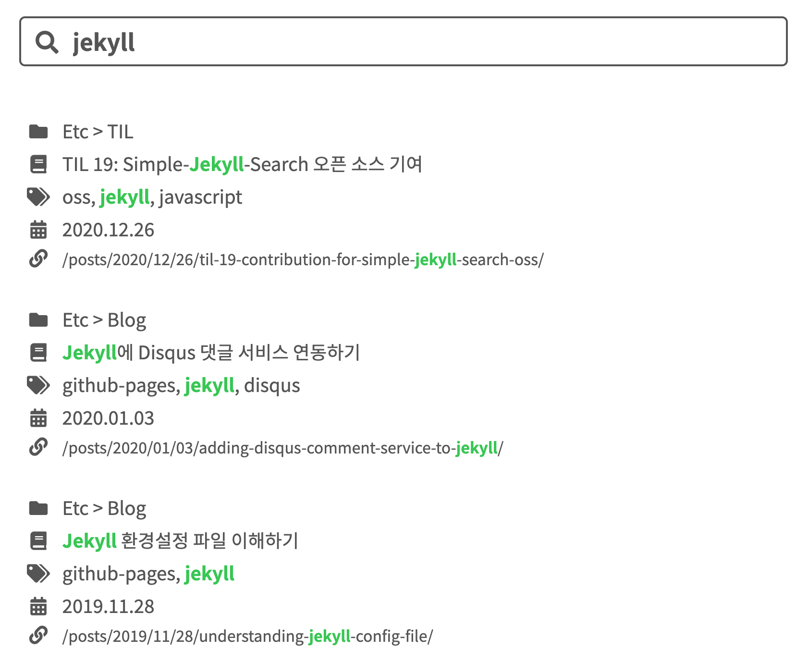

## TL;DR

- 검색 기능으로 [Simple-Jekyll-Search](https://github.com/christian-fei/Simple-Jekyll-Search){:target="_blank"}
라이브러리를 사용하면, Jekyll에 간단한 검색 기능을 추가할 수 있다.

## 개요

블로그에 글을 올리다 보니 간혹 내가 필요한 정보를 찾고 싶을 때 찾을 수 없는 치명적인 문제가 있었다.
그래서 검색 기능의 필요성을 절실히 느꼈고, 어떻게 구현하면 좋을지 컨셉을 고민했다.
현재 블로그의 형태 특성상 검색창이 항상 보이는 것보다 **검색 기능에만 집중할 수 있는 검색 페이지**를 구현해야겠다는 결론에 도달했다.

이제 방법을 생각해야 하는데, 정적 사이트 특성상 데이터를 위한 별도의 서버를 가지고 있지 않기 때문에
일반적인 서비스의 구현하고 다른 방식의 관점으로 접근해야 했다.
검색할 데이터를 미리 준비하고, 해당 데이터에서 원하는 항목을 검색한 후 보여줘야겠다고 생각했다.

마침 [Simple-Jekyll-Search](https://github.com/christian-fei/Simple-Jekyll-Search){:target="_blank"}라는
말그대로 심플한 컨셉의 Jekyll 검색 기능을 위한 오픈 소스 라이브러리가 있었다.
내가 생각했던 것처럼 JSON 파일 형식으로 미리 데이터를 준비하고, 해당 파일로부터 원하는 항목을 검색해 정보로 조립하는 것이었다.
작성일 기준 1.1K 개의 별을 가지고 있을 만큼 신뢰성이 어느 정도 있었기 때문에 바로 사용하기로 했다.

## Simple-Jekyll-Search 연동하기

나는 여러가지 방법 중에 직접 필요한 부분만 블로그에 넣는 방식으로 연동을 진행했다.
결국에는 Jekyll의 빌드 과정과 JavaScript의 로직을 통해 검색 기능이 구현되는 것이기 때문에 관련한 것만 잘 연동한다면,
최소한의 파일만 사용해서 원하는대로 동작 구현이 가능하다.

연동에 앞서 오픈 소스 라이브러리를 사용할 때 가장 이해하기 쉬운 방법이
[예제](https://github.com/christian-fei/Simple-Jekyll-Search/tree/master/example){:target="_blank"}와
[가이드](https://github.com/christian-fei/Simple-Jekyll-Search/wiki){:target="_blank"}를 보는 것이라 생각한다.
연동 과정이 이해가 가지 않는 경우, 앞의 링크를 참고해 실제 코드와 가이드를 보면서 동작 방식을 이해한다면 더 수월하게 연동을 할 수 있을 것이다.

### 1. 필요한 파일 넣기

원하는 기능에 따라 필요한 파일은 다를 수 있지만, 기본적으로 다음과 같은 파일만 있으면 된다.

- `simple-jekyll-search.min.js` 또는 `simple-jekyll-search.js`
([링크](https://github.com/christian-fei/Simple-Jekyll-Search/tree/master/example/js){:target="_blank"})
- `search.json`
([링크](https://github.com/christian-fei/Simple-Jekyll-Search/blob/master/example/search.json){:target="_blank"})

JavaScript 파일은 검색 데이터로부터 **검색 기능**을 사용하기 위한 라이브러리 파일이고,
JSON 파일은 검색 대상이 되는 **검색 데이터**를 준비하기 위한 파일이다.

`*.min.js` 파일은 `*.js` 파일의 압축 버전이라 보면 된다.  
동일한 로직으로 구현되어 있기 때문에 어느 쪽을 사용해도 무관하다.
만약 커스터마이징을 하고 싶은 경우, `*.min.js` 파일을 수정하는 것은 매우 난감하기 때문에
`*.js` 파일을 사용하는 것을 추천한다.

`simple_search_filter.rb`와 같은 플러그인은 왜 추가하지 않는지 의문이 있을 수 있다.
해당 코드를 보면 함수 몇가지를 정의해 놓았는데, 해당 함수를 사용하지 않으며 필수적으로 필요하지도 않기 때문에 첨부하지 않았다.

### 2. 검색 데이터 준비

Jekyll로 만든 블로그는 정적 사이트이기 때문에 검색을 하기 위해 미리 생성된 데이터가 필요하다.
(물론, 별도의 서버를 가지고 있거나 데이터를 준비하는 곳이 있다면 상관 없다.)
이를 위해 예제 프로젝트에 있는 **`search.json` 파일**이 필요하다.



---
layout: none
---
[
  
    {
      "title"    : "{{ post.title | escape }}",
      "category" : "{{ post.category }}",
      "tags"     : "{{ post.tags | join: ', ' }}",
      "url"      : "{{ site.baseurl }}{{ post.url }}",
      "date"     : "{{ post.date }}"
    } ,
  
]



해당 파일을 보면 위와 같이 되어 있는데, **Jekyll의 Liquid 문법으로 JSON 데이터를 생성**하는 것을 볼 수 있다.
전체 포스트를 순회하며 제목, 카테고리, 태그, URL, 날짜 등을 객체로 구성해 배열로 만든다.
따라서 Jekyll로 사이트를 생성할 때 검색 데이터가 JSON 배열로 준비된다.

검색 대상이 되길 원하는 항목이 더 있다면, JSON과 Liquid 문법에 맞춰 추가하면 검색 대상에 포함된다.  
참고로 현재 구현된 검색 페이지에 사용되는 JSON 파일은 다음과 같다.



---
layout: none
---
[
  
    {
      "title"      : {{ post.title | jsonify }},
      "categories" : "{{ post.categories | join: ' > ' }}",
      "tags"       : "{{ post.tags | join: ', ' }}",
      "date"       : "{{ post.date | date: '%Y.%m.%d' }}",
      "urlString"  : "{{ post.url }}",
      "url"        : "{{ post.url | prepend: site.baseurl }}"
    },
  
]



이처럼 검색되길 원하는 문자열로 구성해 데이터를 준비할 수 있도록 한다.  
(`urlString`의 경우, 추후 사용되는 목적이 있어 추가로 넣었다.)

### 3. 검색 부분 레이아웃 구성

검색 기능을 위해 일반적으로 **검색어 입력**을 위한 입력 부분과 **검색 결과**를 보여주기 위한 출력 부분이 필요하다.
[예제 프로젝트](https://github.com/christian-fei/Simple-Jekyll-Search/blob/master/example/_layouts/default.html){:target="_blank"}에서는
`search-demo-container` ID의 `div` 요소 안에 `search-input` ID의 `input` 요소를 입력 부분으로,
`results-container` ID의 `ul` 요소를 출력 부분으로 사용하고 있다.

일반적으로 그것과 동일하게 사용하면 된다.  
참고로 현재 구현된 검색 페이지에 사용되는 레이아웃은 꾸미는 것을 가미해 다음과 같이 작성했다.



  

    <i class="fas fa-search fa-fw"></i>
    <input id="search-input" 
      type="search" 
      tabindex="1" 
      spellcheck="false" 
      placeholder="Search"
    >
  

<ul id="search-results"></ul>


예제 프로젝트와 비슷하게 `search-input` ID의 `input` 요소를 입력 부분으로,
`search-results` ID의 `ul` 요소를 출력 부분으로 사용하고 있다.

### 4. 검색 기능 연동

[예제 프로젝트](https://github.com/christian-fei/Simple-Jekyll-Search/blob/master/example/_layouts/default.html){:target="_blank"}의
하단 부분을 보면, 다음과 같이 JavaScript 코드가 작성되어 있는 것을 볼 수 있다.







`simple-jekyll-search.min.js` 파일을 불러와 사용하고 있으며, 해당 파일을 어디에 두었냐에 따라 경로는 변경될 수 있다.
또한, 편의를 위해 전체 JavaScript 파일을 불러오는 곳에서 해당 파일을 불러와도 된다.

검색 기능을 연동하기 위해 **`SimpleJekyllSearch` 객체를 생성해 `window.simpleJekyllSearch`에 할당**해야 한다.
그 이후부터는 전달한 옵션에 따라 검색 기능이 작동하게 된다.

여기서 가장 중요한 부분은 필수 옵션을 정확히 세팅해야 한다는 것이다.  
헷갈리는 것이 있다면, [가이드](https://github.com/christian-fei/Simple-Jekyll-Search/wiki){:target="_blank"}를 참고해
세팅하길 바란다.

- `searchInput`: 입력 부분에 해당하는 요소
- `resultsContainer`: 출력 부분에 해당하는 요소
- `json`: 검색 대상이 되는 검색 데이터가 있는 JSON 파일
- `searchResultTemplate`: 검색된 항목이 출력 부분에 표시되는 레이아웃.  
`{}` 안에 JSON 객체의 Key를 입력해 검색된 데이터를 맵핑한다.

참고로 현재 구현된 검색 페이지에 사용되는 JavaScript 코드는 다음과 같다.







기본적인 것은 예제 프로젝트와 동일하지만, `searchResultTemplate` 옵션이 복잡해지고, `templateMiddleware` 옵션이 추가되었다.

`searchResultTemplate` 옵션은 검색 결과에 아이콘을 추가해 꾸미기 위해 복잡해졌고,
`templateMiddleware` 옵션은 `searchResultTemplate`에 검색된 데이터가 맵핑되기 전에 수행할 변환 작업을 위해 사용되었다.

`templateMiddleware` 옵션에 사용되는 함수의 로직이 굉장히 복잡해 보이는데,
그 목적은 **검색어에 해당하는 부분을 강조 표시하기 위한 용도**이다.
더불어 실제 검색 대상이 되는 항목(제목, 카테고리, 태그 등)만 강조 표시를 하도록 로직을 추가했다.
그 결과는 다음과 같다.

### 5. 검색 페이지 추가

마지막으로 구성한 레이아웃과 구현한 JavaScript 코드를 원하는 곳에 넣고 페이지로 추가하면 된다.
이것은 예제 프로젝트에는 없는 부분으로, 다른 페이지를 구성하던 방식과 동일하게 페이지를 추가할 수 있다.

현재 구현된 검색 페이지는 `search.html` 파일에 HTML 레이아웃과 JavaScript 코드를 모두 넣고, `_layouts` 디렉터리에 포함시켰다.
그리고 `_pages` 디렉터리에 `search.md` 파일을 만들어 `layout`으로 `search`를 작성했다.


---
layout: search
title: Search
permalink: /search
---


이제 해당 레이아웃은 검색 페이지로 생성될 것이다.
나머지 할 작업은 (Search 메뉴처럼) 원하는 곳에 해당 URL을 연결해 진입하도록 하면 된다.

## 후기

**Simple**-Jekyll-Search라는 이름에 걸맞게 정말 **간단한** 검색 기능만 제공하는 라이브러리라 원하는 동작을 구현하는데 어려움이 많았다.
그래도 나름 적정선에 스스로 합의(?)를 해서 검색 기능 구현이 마무리된 것 같다.
그리고 기능 구현을 하면서 [해당 라이브러리의 버그를 찾아 MR도 시도](https://jamesu.dev/posts/2020/12/26/til-19-contribution-for-simple-jekyll-search-oss/){:target="_blank"}해봤고, 실제 받아들여지기까지 하여 재밌는 경험이었다.

결론적으로 원하는 글을 찾는 데는 문제 없는 수준이 된 것 같아 꽤나 만족스럽지만, 공대 감성의 디자인을 한 것은 어쩔 수 없는 것 같다. 🤔
