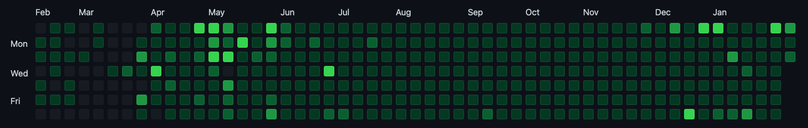
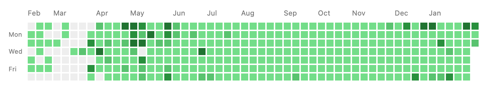

## TL;DR

- `` 한줄로 나의 **잔디**를 표현할 수 있다.
- ``와 같이 **기준 색**을 지정할 수도 있다.

## GitHub Contributions Graph

GitHub를 사용하는 사람이라면 누구나 한번쯤 위와 같은 **GitHub Contributions Graph**를 본 적이 있을 것이다.
그리고 많은 개발자가 이 초록색 네모(일명 잔디)를 채우기 위해 하루하루 코딩을 한다.
이렇게 채운 네모는 코딩을 더 열심히 하게 자극을 주는 동기부여가 된다.

GitHub Contributions Graph를 많이 채웠으면 그것을 누군가에게 자랑을 하고 싶기도 하고,
스스로 보며 뿌듯함을 느끼고 싶기도 할 것이다.
그러기 위해 블로그에 그 그래프를 연동하기도 하는데, 최근에 괜찮은 오픈 소스를 발견해 그것을 이용해
[About](https://jamesu.dev/about){:target="_blank"} 페이지를 꾸몄다.

## Github Chart API 연동

그래프를 보여주기 위해 사용한 오픈 소스는 [Github Chart API](https://github.com/akerl/githubchart){:target="_blank"}라
불리는 **그래프 이미지 생성 API**이다.

Github Chart API는 GitHub 계정으로부터 Contributions 데이터를 불러와 이미지 파일을 생성하고 호스팅을 통해 이미지 파일을 제공해준다.
이미지 파일은 SVG이기 때문에 화면 크기에 맞춰 적절하게 보여질 수 있으며, 원하는 기준 색을 지정해 네모(일명 잔디)의 색을 바꿀 수 있다.

사용법은 정말 간단하다.  
다음 코드와 같이 `img` 요소의 이미지 파일 경로로
**호스팅 사이트(https://ghchart.rshah.org) 뒤에 GitHub 계정명을 덧붙인 경로**를 전달하면 된다.





앞서 얘기한 것처럼 **기준 색**을 지정하고 싶다면,
다음 코드와 같이 **GitHub 계정명 앞에 16진수 색상 코드**를 덧붙이면 된다.





위 코드를 적용한 [About](https://jamesu.dev/about){:target="_blank"} 페이지의 이미지는 다음과 같다.

해당 이미지는 현재의 GitHub 데이터를 기준으로 하기 때문에 최신 이미지가 유지될 수 있다.
물론, 이미지 파일이 캐싱되어 이전 상태의 이미지가 보일 수 있으니 그런 경우 캐시를 제거하고 확인해 봐야 한다.

Github Chart API에서 생성하는 이미지 파일은 [GithubChart](https://github.com/akerl/githubchart){:target="_blank"}라 하는
다른 오픈 소스로부터 생성된 것이다.
만약, 이미지 파일을 생성하는 로직이 궁금하거나 해당 루비 라이브러리를 직접 연동하고 싶은 경우, GithubChart를 참고하면 도움이 될 것이다.

얼른 한줄의 코드를 통해 자신의 GitHub Contributions Graph를 뽐내도록 하자! 😎
