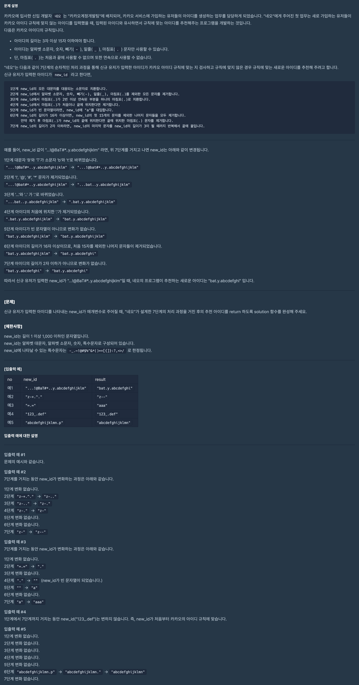

## 문제 파악

[문제 링크](https://programmers.co.kr/learn/courses/30/lessons/72410){:target="_blank"}

주어진 조건에 따라 단계별로 변환 과정을 거치면 된다.  
조건의 구체적인 사항을 놓치지 않도록 주의한다.

## 문제 풀이

문제에서 단순히 변환 조건만 명시하지 않고, 친절하게 단계별로 어떻게 변환하는 지를 알려주고 있으므로
차례대로 따라 가면서 변환을 거치면 해결할 수 있다.

단계별 변환 조건을 보면 몇몇 단계에서는 까다로워 보일 수 있는 조건들이 있는데,
이는 [정규 표현식(정규식, Regular Expression, regex)][정규 표현식]{:target="_blank"}을 이용하면 쉽게 해결할 수 있다.

- 2단계: `^` 문자를 이용해 반대 조건에 해당하는 문자를 빈 문자열로 치환한다.
  - `re.sub(r'[^a-z0-9-_.]', '', new_id)`
- 3단계: `{2,}`를 이용해 2번 이상 반복되는 것을 찾아내어 `.` 문자로 치환한다.
  - `re.sub(r'[.]{2,}', '.', new_id)`
- 4단계: `^` 문자로 처음 위치를, `$` 문자로 끝 위치의 `.` 문자를 찾아내어 빈 문자열로 치환한다.
  - `re.sub(r'^[.]|[.]$', '', new_id)`
- 6단계: `[:15]`를 이용해 16자 미만의 문자만 추출해내고, `$` 문자로 끝 위치의 `.` 문자를 찾아내어 빈 문자열로 치환한다.
  - `re.sub(r'[.]$', '', new_id[:15])`

이렇게 하면, 정규식을 이용해 간단히 변환을 할 수 있다.  

추가적으로 5단계에서 `new_id`가 빈 문자열이라면, 6단계를 무시하고 7단계로 넘어가도 되므로 분기를 해도 된다.

## 풀이 소스

문제 풀이 환경: Python 3


import re

def solution(new_id):
    new_id = new_id.lower()
    new_id = re.sub(r'[^a-z0-9-_.]', '', new_id)
    new_id = re.sub(r'[.]{2,}', '.', new_id)
    new_id = re.sub(r'^[.]|[.]$', '', new_id)
    if new_id:
        new_id = re.sub(r'[.]$', '', new_id[:15])
        if len(new_id) < 3:
            new_id = new_id.ljust(3, new_id[-1])
    else:
        new_id = 'aaa'
    return new_id


[정규 표현식]: https://ko.wikipedia.org/wiki/%EC%A0%95%EA%B7%9C_%ED%91%9C%ED%98%84%EC%8B%9D
