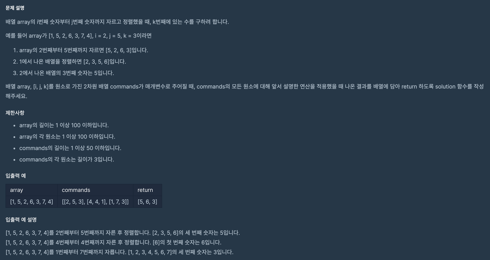

## 문제 파악

[문제 링크](https://programmers.co.kr/learn/courses/30/lessons/42748){:target="_blank"}

주어진 단계별 로직을 적용해 변환을 하면 된다.  
별도로 예외 처리에 대한 언급이 없으니 정상적인 입력만 들어온다고 생각할 수 있다.

## 문제 풀이

`commands` 배열을 순회하며, 각 명령(`cmd`)에 대해 다음과 같이 단계별 로직을 적용해 변환할 수 있다.

1. `cmd[0]`이 `i`이고 `cmd[1]`이 `j`이므로, `array[cmd[0] - 1:cmd[1]]`를 통해 배열을 자른다.
2. `sorted` 함수를 통해 배열을 오름차순으로 정렬한다.
3. `cmd[2]`가 `k`이므로, `[cmd[2] - 1]`와 같이 배열의 요소를 꺼낸다.

최종적으로 꺼낸 요소를 모아 배열화 해서 반환하도록 한다.

## 풀이 소스

문제 풀이 환경: Python 3


def solution(array, commands):
    return [sorted(array[cmd[0] - 1:cmd[1]])[cmd[2] - 1] for cmd in commands]

