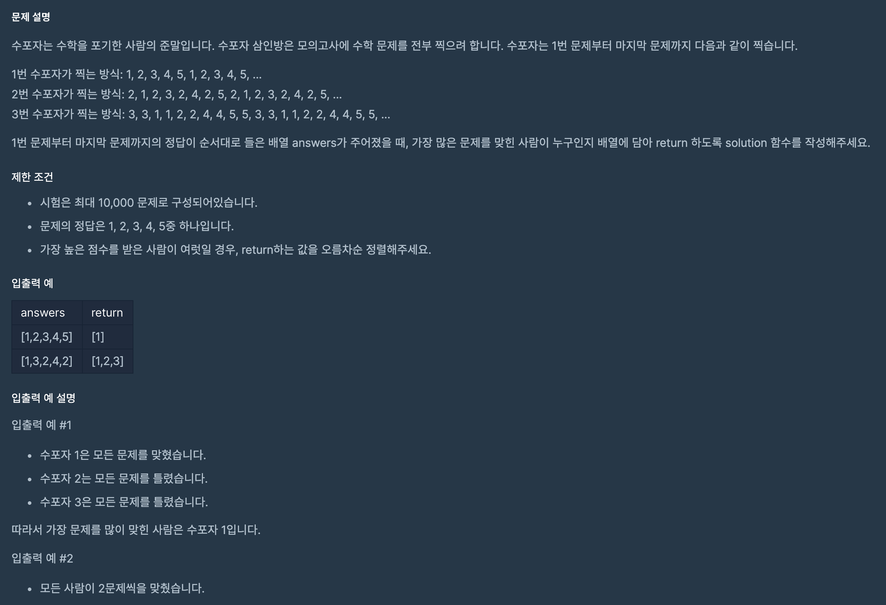

## 문제 파악

[문제 링크](https://programmers.co.kr/learn/courses/30/lessons/42840){:target="_blank"}

3명의 수포자가 답을 찍는 패턴을 이용하는 것이 핵심이다.

## 문제 풀이

각 수포자의 답을 찍는 패턴을 일반화 하는 것이 까다로우므로, 반복되는 부분을 패턴으로 취급하면 된다.

- 1번 수포자: 1, 2, 3, 4, 5, ...
- 2번 수포자: 2, 1, 2, 3, 2, 4, 2, 5, ...
- 3번 수포자: 3, 3, 1, 1, 2, 2, 4, 4, 5, 5, ...

위 패턴을 바탕으로 정답 배열을 순회하며 정답 여부를 모아 점수를 계산할 수 있다.

이때, 패턴을 원형 큐와 같이 이용하고자 `%` 연산을 통해 패턴 값에 접근해야 한다.  
`marks`를 수포자 3명의 패턴 배열 목록이라 하고 `j`를 수포자 인덱스라 했을 때,
`marks[j][i % len(marks[j])]`와 같이 원형 큐처럼 이용할 수 있다.

마지막으로 가장 높은 점수를 받은 수포자만 걸러 정렬한 뒤 반환해야 한다.

## 풀이 소스

문제 풀이 환경: Python 3


def solution(answers):
    marks = [
        [1, 2, 3, 4, 5],
        [2, 1, 2, 3, 2, 4, 2, 5],
        [3, 3, 1, 1, 2, 2, 4, 4, 5, 5]
    ]
    scores = [0] * 3
    for i in range(len(answers)):
        for j in range(3):
            scores[j] += answers[i] == marks[j][i % len(marks[j])]
    max_score = max(scores)
    return sorted(i + 1 for i in range(3) if scores[i] == max_score)

