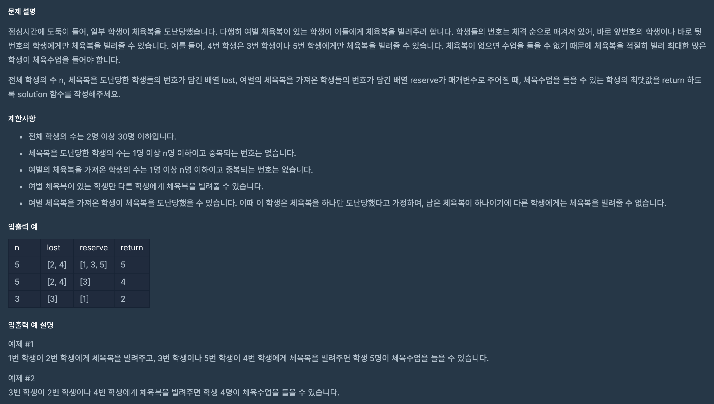

## 문제 파악

[문제 링크](https://programmers.co.kr/learn/courses/30/lessons/42862){:target="_blank"}

- 체육복을 도난당한 학생들이 얼마나 많은 체육복을 빌릴 수 있는지를 구해야 한다.
- 체육복은 주변 학생으로부터 빌릴 수 있는 것이 핵심으로 보인다.
- 제한사항에 의한 예외 케이스에 주의한다.

## 문제 풀이

체육복을 도난당한 학생들을 기준으로 **차례대로 각 학생이 빌릴 수 있는 경우를 구한다면**,
최종적으로 최대한 많은 학생이 체육복을 빌릴 수 있게 된다.
이처럼 부분 최적해(각 학생이 빌릴 수 있는 경우)를 구하면,
전체 최적해를 구할 수 있으므로 [탐욕(Greedy) 알고리즘][탐욕 알고리즘]{:target="_blank"}을 이용할 수 있다.

부분 최적해를 구하기 앞서 제한사항을 보면, 다음과 같은 문구가 있다.

- 여벌 체육복을 가져온 학생이 체육복을 도난당했을 수 있습니다. 이때 이 학생은 체육복을 하나만 도난당했다고 가정하며, 남은 체육복이 하나이기에 다른 학생에게는 체육복을 빌려줄 수 없습니다.

이 말은 어떤 학생이 도난당한 학생에 속할 수도, 여벌의 체육복을 가진 학생에 속할 수도 있다는 것이다.
따라서 이것을 먼저 필터링해 **체육복을 빌려야만 하는 학생과 여벌의 체육복을 빌려줄 수 있는 학생**을 다시 구한다.


reserve_lost = set(lost).intersection(set(reserve))
lost = sorted(set(lost) - reserve_lost)
reserve = list(set(reserve) - reserve_lost)


이제 체육복을 도난당한 학생들을 정렬을 통해 줄지어 서게 하고 체육복을 빌리게 하면,
앞에서부터 최대한 체육복을 빌리려고 할 것이다.
**빌린 후에는 해당 학생을 도난당한 학생 목록에서 제거하고, 빌려준 학생을 여벌 체육복을 가진 학생 목록에서도 제거해야 한다**.


for p in list(lost):
    if p - 1 in reserve:
        reserve.remove(p - 1)
        lost.remove(p)
    elif p + 1 in reserve:
        reserve.remove(p + 1)
        lost.remove(p)


최종적으로 전체 학생 수 `n`에서 체육복을 빌리지 못한 학생 수(도난당한 학생 목록에 남은 학생 수) `len(lost)`를 빼면 된다.

## 풀이 소스

문제 풀이 환경: Python 3


def solution(n, lost, reserve):
    reserve_lost = set(lost).intersection(set(reserve))
    lost = sorted(set(lost) - reserve_lost)
    reserve = list(set(reserve) - reserve_lost)

    for p in list(lost):
        if p - 1 in reserve:
            reserve.remove(p - 1)
            lost.remove(p)
        elif p + 1 in reserve:
            reserve.remove(p + 1)
            lost.remove(p)
    return n - len(lost)


[탐욕 알고리즘]: https://en.wikipedia.org/wiki/Greedy_algorithm
