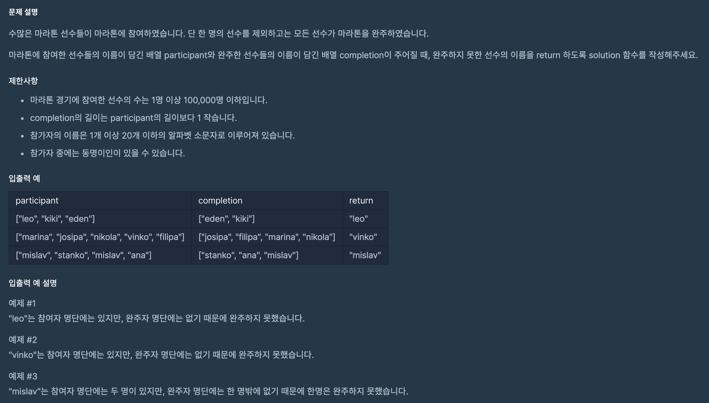

## 문제 파악

[문제 링크](https://programmers.co.kr/learn/courses/30/lessons/42576){:target="_blank"}

동명이인이 있을 수 있다는 것에 주의해 문제를 풀어야 한다.

## 문제 풀이

`completion`의 길이가 `participant`의 길이보다 1이 작으므로,
`completion` 배열을 순회하며 `participant` 배열에서 `remove` 함수로 한명씩 제거하면 최종적으로 1명이 남게 된다.
그 1명이 완주하지 못한 선수가 된다.

하지만, 이렇게 풀면 배열의 길이가 아주 큰 경우,
`completion` 배열을 순회하는 것과 `participant` 배열에서 제거하기 위해 순회하는 것을 합쳐
오랜 시간이 걸리므로, 최악의 경우 `O(n^2)`의 시간복잡도가 될 수 있다.

따라서, `completion` 배열과 `participant` 배열을 **이름을 키로 가지고 인원을 값으로 가지는 Dictionary**로 변형해
인원을 감소시키는 방식으로 순회한다면, 시간복잡도가 `O(n)`으로 줄어들 수 있다.

Python에서는 `collections` 모듈의 `Counter` 클래스를 사용한다면,
**요소를 키로 가지고 빈도수를 값으로 가지는 Dictionary**로 쉽게 변형시킬 수 있다.
그리고 두 `Counter` 객체의 `-` 연산을 통해 차집합 효과를 낼 수 있다.

최종적으로 빈도수가 1인 하나의 요소만 남게 되고, 해당 요소가 선수의 이름에 해당하므로 완주하지 못한 선수를 손쉽게 구할 수 있다.

## 풀이 소스

문제 풀이 환경: Python 3


from collections import Counter

def solution(participant, completion):
    return list(Counter(participant) - Counter(completion))[0]

