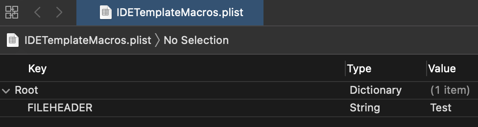
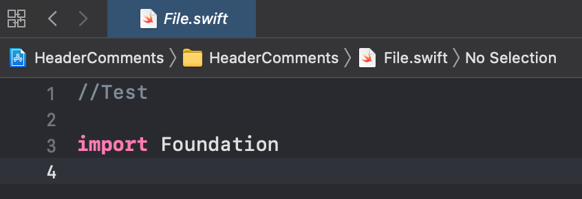
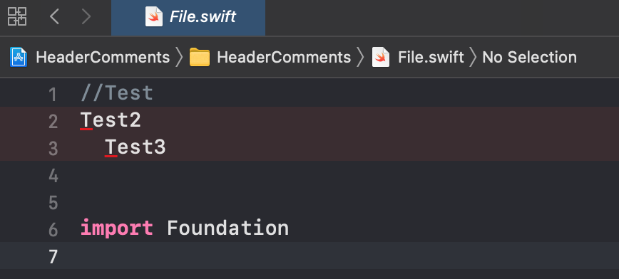
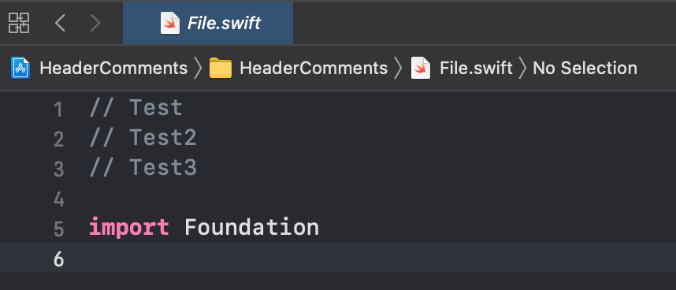
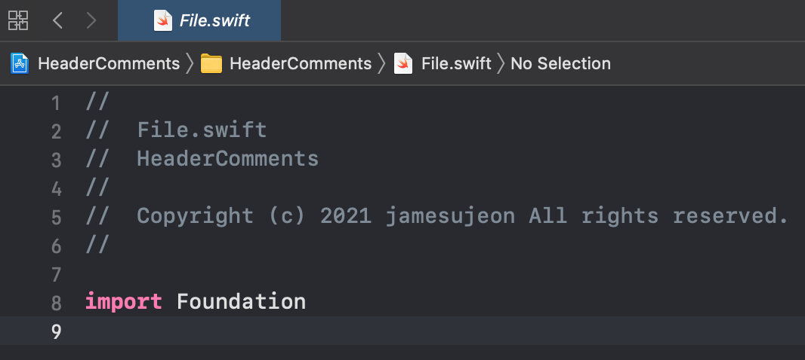

## TL;DR

- `IDETemplateMacros.plist` 파일을 생성해 [매크로][Text macros reference]{:target="_blank"}와 함께
일관성 있는 헤더 주석을 구성할 수 있다.
- 팀 프로젝트 내의 공유를 위해서는 Project shared data 경로에 `IDETemplateMacros.plist` 파일을 위치시키고 Git에 Push한다.

## 일관성 있는 파일 헤더 주석

일반적으로 프로그래밍을 하는 회사라면 사내 코딩 스타일 가이드가 이미 있거나 도입을 고민할 것이다.
그런 코딩 스타일 가이드에는 파일명이나 파일에 대한 일정한 규칙이 존재할 수 있다.
특히, 소스 파일에는 파일의 상단부에 저작권 등 각 파일에 대한 정보를 명시하는 경우가 많다.  

파일의 상단부에 명시하는 주석을 Xcode에서는 **File Header Text**라 할 수 있는데, 여기서는 파일 헤더 주석이라 명칭한다.
이 파일 헤더 주석은 코딩 스타일 가이드에 따라 회사마다 다 다를 수 있으므로, 커스터마이징이 필요한 시점이 올 것이다.

Xcode에서는 일관성 있는 파일 헤더 주석을 설정할 수 있도록 설정 파일을 제공한다.
그 파일을 추가해서 파일 헤더 주석을 설정해보고, 각자 입맛에 맞춰 프로젝트에 적용하도록 하자.

여기서의 설정 방법은 Xcode 공식 문서 중 [Customize text macros][Customize text macros]{:target="_blank"}를 참고했다.

## IDETemplateMacros.plist 추가하기

파일 헤더 주석을 설정하기 위해 `IDETemplateMacros.plist`라는 Property List 파일을 Xcode의 특정 위치에 놓아야 한다.
이 파일을 어디에 놓는지에 따라 해당 설정이 Xcode에 적용되는 범위가 다르다.

- Project user data: 프로젝트의 현재 유저 전용 데이터  
`<ProjectName>.xcodeproj/xcuserdata/[username].xcuserdatad/IDETemplateMacros.plist`
- **Project shared data**: 프로젝트 내 공유 데이터  
`<ProjectName>.xcodeproj/xcshareddata/IDETemplateMacros.plist`
- Workspace user data: 워크스페이스의 현재 유저 전용 데이터  
`<WorkspaceName>.xcworkspace/xcuserdata/[username].xcuserdatad/IDETemplateMacros.plist`
- **Workspace shared data**: 워크스페이스 내 공유 데이터  
`<WorkspaceName>.xcworkspace/xcshareddata/IDETemplateMacros.plist`
- User Xcode data: 현재 컴퓨터 유저의 Xcode 전용 데이터  
`~/Library/Developer/Xcode/UserData/IDETemplateMacros.plist`

일반적으로 팀 프로젝트를 진행할 때, `xcuserdata`는 유저 전용 데이터이므로
`.gitignore` 파일에 항목을 추가해 Git에 공유하지 않는다.
팀원들이 공유하고자 하는 정보는 `xcshareddata`을 통해 Git에 공유한다.

따라서 사내 코딩 스타일 가이드를 따르기 위해서는 **Project shared data**를 이용하도록 하고,
`CocoaPods`를 사용한다면 워크스페이스를 이용하므로 **Workspace shared data**를 이용한다.
하지만, **Project shared data**에 세팅해도 워크스페이스에 적용되므로 **Project shared data**를 이용해도 된다.

Property List 파일은 특정 규칙을 지닌 XML 파일이므로,
**다음 코드를 그대로 복사해 `IDETemplateMacros.plist` 파일을 생성하거나**
**Xcode를 통해 Property List 파일을 생성한 후에 이동시키면 된다**.


<?xml version="1.0" encoding="UTF-8"?>
<!DOCTYPE plist PUBLIC "-//Apple//DTD PLIST 1.0//EN" "http://www.apple.com/DTDs/PropertyList-1.0.dtd">
<plist version="1.0">
<dict/>
</plist>


그리고 해당 파일을 Xcode로 열어 수정하면, Xcode에 설정 내용을 적용할 수 있게 된다.

## 파일 헤더 주석 맛보기

`IDETemplateMacros.plist` 파일을 Xcode로 열어 `Root` 아래로 `FILEHEADER` 키를 추가하고, 아무 값이나 String 값으로 넣어보자.
여기서는 `Test`라고 넣어 보았다.

그리고 `IDETemplateMacros.plist` 파일을 넣은 프로젝트에서 새로운 파일을 추가해보면, 다음과 같이 파일 상단부에 `//Test`라고 추가되는 것을 확인할 수 있다.

이제 본격적으로 꾸미고자 여러 줄을 넣고자 하면, Xcode를 통해서는 여러 줄을 수정하기가 불편한 것을 알 수 있다.
그래서 XML 파일을 직접 수정하는 것이 훨씬 편하다.
해당 파일을 VSCode 같은 다른 편집기로 열어보자.

그러면 다음과 같은 코드를 볼 수 있고, `FILEHEADER` 키 태그랑 동일한 레벨에 있는 `string` 태그를 통해 값을 설정하면 된다는 것을 알 수 있다.


<?xml version="1.0" encoding="UTF-8"?>
<!DOCTYPE plist PUBLIC "-//Apple//DTD PLIST 1.0//EN" "http://www.apple.com/DTDs/PropertyList-1.0.dtd">
<plist version="1.0">
<dict>
  <key>FILEHEADER</key>
  <string>Test</string>
</dict>
</plist>


개행도 넣어보고, 이것저것 작성해보면 헤더 주석이 어떻게 들어가는지 알 수 있다.
다음과 같이 작성하면 새 파일을 추가했을 때 생각했던 것처럼 보이지 않고 이상하게 보여진다.


<?xml version="1.0" encoding="UTF-8"?>
<!DOCTYPE plist PUBLIC "-//Apple//DTD PLIST 1.0//EN" "http://www.apple.com/DTDs/PropertyList-1.0.dtd">
<plist version="1.0">
<dict>
  <key>FILEHEADER</key>
  <string>Test
Test2
  Test3
  </string>
</dict>
</plist>


**보는 것과 같이 첫 줄에만 `//` 문자열이 앞에 붙고, 그 이후부터는 일반 텍스트 취급**을 하기 때문에 개행이나 띄어쓰기를 잘 작성해야 한다.
심지어 마지막 `</string>` 앞에 있는 띄어쓰기와 개행도 인식하는 것을 알 수 있다.

개행, 띄어쓰기, 주석 문자열을 적절히 넣어 작성한다면 다음과 같이 작성할 수 있다.


<?xml version="1.0" encoding="UTF-8"?>
<!DOCTYPE plist PUBLIC "-//Apple//DTD PLIST 1.0//EN" "http://www.apple.com/DTDs/PropertyList-1.0.dtd">
<plist version="1.0">
<dict>
  <key>FILEHEADER</key>
  <string> Test
// Test2
// Test3</string>
</dict>
</plist>


## 파일 헤더 주석 구성하기

기본적인 사용법을 알았다면, 이제 원하는 규칙대로 설정할 차례이다.

Xcode 공식 문서의 [Text macro format reference][Text macro format reference]{:target="_blank"}와
[Text macros reference][Text macros reference]{:target="_blank"}를 보면,
주석을 구성하기 위해 필요한 정보를 어떤 매크로를 통해 얻을 수 있는 지 알 수 있다.

자세한 것은 위 링크에서 살펴보도록 하고, 여기서는 몇 가지 매크로만 예시로 사용할 것이다.  
**매크로의 앞 뒤에 `_` 문자를 각 3개씩 추가해서 매크로를 사용할 수 있다**.

- FILENAME: 현재 파일명
- PROJECTNAME: 현재 프로젝트명
- YEAR: 현재 연도

다음과 같이 위 매크로와 함께 저작권을 고정시키고자 개인적인 아이디를 직접 넣어 작성해 보았다.


<?xml version="1.0" encoding="UTF-8"?>
<!DOCTYPE plist PUBLIC "-//Apple//DTD PLIST 1.0//EN" "http://www.apple.com/DTDs/PropertyList-1.0.dtd">
<plist version="1.0">
<dict>
  <key>FILEHEADER</key>
  <string>
//  ___FILENAME___
//  ___PROJECTNAME___
//
//  Copyright (c) ___YEAR___ jamesujeon All rights reserved.
//</string>
</dict>
</plist>


작성한 코드와 결과물을 비교해보면 어떻게 구성할 수 있을지 파악이 될 것이다.

[Customize text macros]: https://help.apple.com/xcode/mac/9.0/index.html?localePath=en.lproj#/dev91a7a31fc
[Text macro format reference]: https://help.apple.com/xcode/mac/9.0/index.html?localePath=en.lproj#/devc8a500cb9
[Text macros reference]: https://help.apple.com/xcode/mac/9.0/index.html?localePath=en.lproj#/dev7fe737ce0
