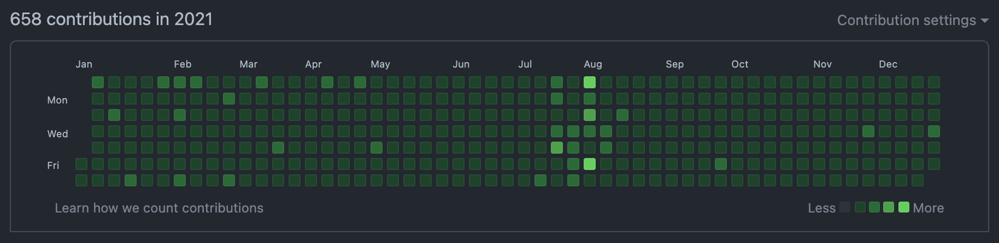

## TL;DR

- GitHub 연속 일일 커밋은 `597`일째 진행중이다.
- 작년의 가장 큰 성과는 **이직**이었다.
- 올해는 **프로젝트 설계**에 초점을 맞춰 공부를 하자.
- 2022년에는 `설계에 깊이를 더한 iOS 개발자`가 되보자.

## Today I Committed

{:width="100%"}
*GitHub Contributions in 2021*

2021년에도 연속 일일 커밋을 이어가면서 꾸준히 노력하여 365일을 모두 채우고, **597일째**를 달성했다. 🥳

시간이 빠듯하거나 커밋하기 귀찮은 날은 주로 쉬운 문제를 풀어 빠르게 커밋을 했다.
그리고 약속이 있거나 예상치 못한 일이 생길 거 같은 예감(?)이 드는 날에는 미리 커밋을 하는 나름의 노하우가 생겼다. 😎  
그러다보니 이제 하루라도 커밋을 안 하면 신경쓰여서 자주 내 깃헙에 방문하여 확인하는 강박증 비스무리한 것이 생겼다.  
나름 유익한 강박증이니 없애지 않고, 잘 유지해야겠다. 🤔

이 기세를 계속 유지하여 2022년에도 하루도 빠지지 않고 일일 커밋을 하고, 그에 더해 커밋양을 늘리도록 노력해야겠다.  
Contributions을 초록색으로 가득 채우는 것은 성공했으니, 이제 밝게 빛나는 초록색을 많이 채워야 할 차례다! 🔥

## Today I Worked

기존에 다니던 직장에서 마지막 프로젝트를 잘 마무리하고, 생각보다 좋은 곳으로 이직도 하여 열심히 적응하고 있어 만족스런 한 해였다.  
특히, 그 마지막 프로젝트는 완성도를 높이기 위해 개인적으로 여러 팀과의 의사소통을 자주 긴밀하게 하여 꼼꼼하게 개발을 했던 프로젝트였다.
최종 결과물이 만족스럽게 나와 뿌듯했지만, 이직하기 전에 출시를 못한 것이 조금 아쉬웠다. (결국엔 잘 출시되었다. 써보진 않았지만. 🙄)

작년의 개인적인 성과라 하면, 이미 말했던 **사내 iOS 공통 라이브러리를 이용한 앱 개발, 이직**이라 할 수 있다.  
사내 iOS 공통 라이브러리를 이용한 앱 개발은 많이 신경 썼던 마지막 프로젝트인 만큼 재밌었던 일이지만, 아무래도 가장 큰 변화이자 성과는 이직이었다.

### 사내 iOS 공통 라이브러리를 이용한 앱 개발

앞서 말한 것과 같이, 계속 개발중이던 사내 iOS 공통 라이브러리를 이용해 마지막 프로젝트를 진행했다.  
여러 앱에서 사용할 수 있도록 설계한 라이브러리였기에 특정 프로젝트 내부에서는 그것에 맞게 커스터마이징 할 필요가 있었다.
그렇게 라이브러리를 이용해 앱에 맞게 커스터마이징 하는 과정도 재밌었고,
중간에 특정 UI에 대한 요구사항이 변경되면 앱 전체적으로 해당 UI를 공통적으로 사용하고 있기 때문에 손쉽게 수정을 진행할 수 있었다.

**직접 개발한 라이브러리를 활용하면서 생산성과 완성도가 올라가는 것이 눈에 보여 뿌듯했다.**  
다음에도 이처럼 라이브러리를 만들 기회가 생기면, 또 다시 재밌는 것을 경험할 좋은 기회가 될 것 같다. 🙂

### 이직

이직은 몇년 전부터 노래만 부르다가 마침내 성공했다.  
기존보다 좋은 환경과 조건으로 이직을 해서 기쁘고, 완전히 새로운 환경과 프로젝트에 적응하는 재미도 느끼고 있는 중이다.  
물론, 기존과 다른 환경에서 느껴지는 단점으로 인해 불편함을 느끼는 부분도 가끔 있다. 🙄  

또한, 이직을 진행하는 과정에서 다양한 회사의 채용 프로세스를 마주하며, 어느 하나 소홀히 하면 안되겠다는 생각이 들었다.
특히, 기술 면접을 진행하면서 나의 무지함이 생각보다 더 드러나 아직 한참 멀었다는 생각도 들었다.
물론, 면접이라 떨리는 것도 있지만, 머릿속으로는 알고 있으면서 자세하게 설명하기에는 내가 아직 덜 흡수한 개념들이 은근 있었다.  
**올해는 기초부터 응용까지 누구에게나 설명할 수 있을 정도로 빠삭하게 알 수 있도록 노력하자.** 💪

참고로 이직에 대한 자세한 후기는 [여기](https://jamesu.dev/posts/2021/12/25/til-36-job-change-review/){:target="_blank"} 있다. 🙄

## Today I Learned

### 글쓰기

어떤 방식으로든 배운 것을 TIL이나 글로 작성하기로 마음 먹었지만, 습관들지 않은 글쓰기는 정말 손에 잡히지 않고 꾸준히 하기 힘든 것 같다.
1년 동안 배운 것이 많은 것 같은데, 나중에 글로 쓰려고 미루고 미루다 안 쓴 것들이 가득이고 정리할 엄두가 안 나는 것도 많다.

언제쯤 글쓰기에 습관이 들 수 있을까? 🤔  
올해는 조금이라도 더 글쓰는 습관이 익숙해지길 바라며, 스스로에게 자주 채찍질을 해야겠다.

### iOS 개발 트렌드

재작년에 공부하려던 iOS 개발 트렌드는 RxSwift, iOS 디자인 패턴, CI/CD가 있다.

RxSwift는 사내 iOS 공통 라이브러리를 이용한 앱을 개발할 때, 네트워크 처리에만 부분적으로 적용했다.  
**실제 프로젝트에 적용해보니 여러 API 요청을 손쉽게 조합하고 응용할 수 있어 매우 유용했다.**
예를 들어, 다수의 API를 요청하고 적어도 하나의 API가 실패를 했을 때 에러 팝업을 띄우고 싶다면,
API 요청들을 `zip`으로 묶어서 응답을 단일화 시킨 다음에 실패 처리를 하는 부분에서 에러 팝업을 띄우면 간단히 처리할 수 있다.
반면에 콜백 방식으로 처리했다면, 코드가 좀 더 복잡해져 생산성이 저하되고 버그가 발생할 확률이 높아졌을 것이다.  
추후에는 네트워크 처리뿐만 아니라 더 넓은 범위에서 RxSwift를 써보고 싶다. 🔥

iOS 디자인 패턴 중 가장 인기있는 패턴이라 생각한 MVVM을 좀 공부했었다.  
공부한 것을 토대로 실제로 토이 프로젝트나 이직할 때의 사전 과제 등에 적용해보니 유용한 것을 느낄 수 있었다.
**특히, 각 역할을 확실히 구분하여 코딩해보니 어떤 로직을 변경해야 할 때 어디를 바꿔야 할 지 바로 떠올라 손쉽게 고칠 수 있었다.**
이런 장점을 프로젝트 내에서 공유한다면, 팀원 전체적으로 생산성이 많이 향상될 것이라 예상한다.  
점점 프로젝트 설계에 대한 관심이 늘고 있어 공부하기에 재미있는 주제였다. 🤓

CI/CD는 신경을 많이 못 썼다.  
전직장에서 CI/CD는 손도 못 댔지만, 현직장에서는 CI/CD를 기본으로 하고 있기 때문에 배울점이 많을 것 같다.
회사에 많이 적응하고 나면, 본격적으로 CI/CD에 대해서도 공부를 진행해야겠다.  
추후에 개인 프로젝트에 적용한다면, **배포 과정이 많이 편리해질 것 같다.** 🤔

## Tomorrow I will Learn

이직 과정을 통해 느꼈듯이 앞으로 공부해야 할 것은 산더미지만,
기본기는 당연히 해야하므로 제외하고 개인적으로 주목하고 있는 몇가지만 기록으로 남기고 싶다.

### RxSwift, Combine

비동기 이벤트를 처리하기에 적합한 라이브러리로 [RxSwift](https://github.com/ReactiveX/RxSwift){:target="_blank"}가 있었지만,
애플에서 [Combine](https://developer.apple.com/documentation/combine){:target="_blank"}이라는 녀석을 내놓았다.

RxSwift의 장점을 Combine에서도 유사하게 느낄 수 있고, Combine은 애플의 공식 프레임워크이기 때문에 Combine을 공부하는 쪽이 나을 것이다.
하지만, Combine은 iOS 13 이상에서 지원하기 때문에 iOS 12 이하를 지원하는 앱에서는 사용할 수 없다.

물론, iOS 유저의 경우 iOS 버전 업데이트 비율은 매우 높기 때문에 주로 타겟 버전으로 `최신 iOS 버전 - 2` 이상을 잡는 편이고,
현재 그것은 iOS 13(현재 최신 버전은 iOS 15) 이상이기에 Combine 사용 조건을 만족하고 있다.

그래서 **iOS 13 이상을 타겟 버전으로 잡는 것이 확실하다면, 추후 SwiftUI와의 조합도 고려해서 Combine 위주로 공부하는 것이 좋고, 혹시 모르니 RxSwift를 함께 공부하는 것도 괜찮을 것 같다.**  
두 개를 비교하면서 공부하면 재미도 더 있을 것이다. 🙄

### MVVM

올해는 iOS 디자인 패턴 중 MVVM을 더 깊이 공부하려 한다.  
현재 사내 프로젝트에는 MVVM을 부분적으로만 적용하고 있지만, 공부를 통해 탄탄한 지식을 쌓아 그 범위를 넓히고 싶다.
특히, 사내 프로젝트에 적용한 MVVM 구조는 RxSwift나 Combine을 사용하고 있지 않아,
추후에 최소 타겟 버전을 iOS 13 이상으로 올린다면 Combine을 반영하고 싶기도 하다.

**MVVM을 반영하는 방법도 개발자마다 다 다르기 때문에 최종적으로 베스트 프랙티스가 무엇인지 정립하고 싶다!** 🤔

### SwiftUI

[SwiftUI](https://developer.apple.com/kr/xcode/swiftui/){:target="_blank"}는 선언형 코드를 작성해 UI를 쉽고 빠르게 구현할 수 있도록 도와준다.  
개인적으로 스토리보드나 XIB를 이용한 UI 구현은 은근 불편한 점이 많아, 코드 기반 UI 구현을 선호하곤 했다.
만약, SwiftUI가 보편화 된다면, 코드 기반 UI 구현을 선호하는 나에게는 정말 유용하고 더 선호할만한 도구가 될 것 같다.

iOS 13 이상부터 사용할 수 있기 때문에 그동안은 공부를 미루고 있었지만,
슬슬 최소 타겟 버전으로 iOS 13을 채택할 시기가 다가오고 있는 만큼 공부할 필요를 느꼈다.
특히, 현재 사내 프로젝트의 최소 타겟 버전을 곧 iOS 13으로 올릴 수도 있기 때문에 더욱 관심이 생긴 이유도 있다. 🙄

또한, **애플에서 마치 `SwiftUI + Combine` 조합을 고려해 두 프레임워크를 설계한 것과 같이 둘은 찰떡궁합이기 때문에 해당 조합 위주로 공부를 할 예정이다.**
**추가로 앞서 언급한 MVVM도 같이 공부하면서 `SwiftUI + Combine + MVVM` 조합이 된다면, 아름다운 설계가 될 것 같다.** 😎

## Tomorrow I will Become

작년의 목표가 **깊이가 깊은 iOS 개발자**가 되는 것이었는데, 작은 웅덩이 수준의 깊이만 깊어진 것 같다. 🤔  
주로 이직에 초점이 맞춰 있어 이직 준비와 관련된 공부 위주로 진행하다보니 의도하던대로 깊어지지 못한 것 같다.
그래도 성공적으로 이직을 했기 때문에 뜻깊고 만족스러운 한 해였다.

2022년의 목표는 좀 더 구체적으로 **설계에 깊이를 더한 iOS 개발자**가 되는 것이다.  
작년과 달리 올해는 목표가 구체화된 만큼 **RxSwift, Combine, SwiftUI, MVVM**에 초점을 맞춰 더 성장해야겠다. 🔥
