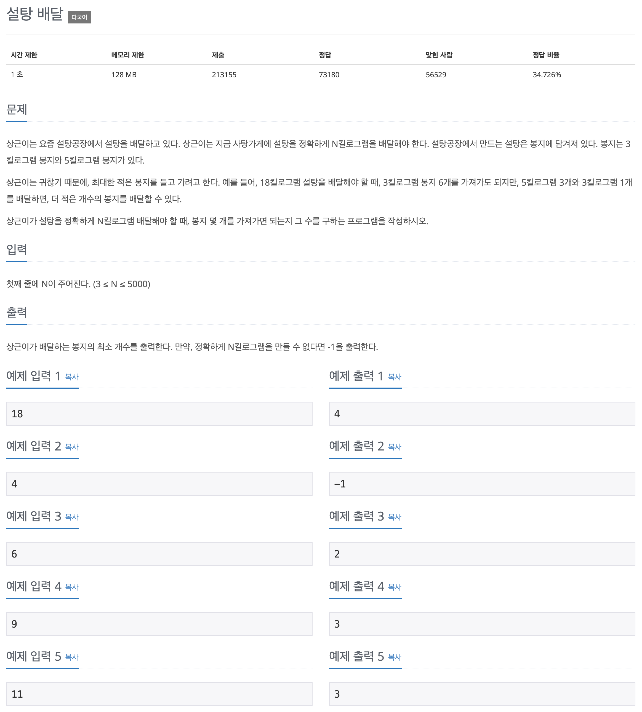

## 문제 파악

[문제 링크](https://www.acmicpc.net/problem/2839){:target="_blank"}

최대한 적은 봉지를 들고 가려고 하므로, 5킬로그램 봉지의 개수가 최대가 되야 한다는 것을 알 수 있다.  
따라서, 5킬로그램 봉지의 개수를 기준으로 생각하면 문제를 수월하게 풀 수 있다.

## 문제 풀이

5킬로그램 봉지 개수의 변화에 따라 그때그때 최적의 해를 구하면 그것이 최종적인 해가 될 수 있으므로,
이 문제는 [탐욕(Greedy) 알고리즘][탐욕 알고리즘]{:target="_blank"}이라 할 수 있다.

주어진 N에 대해 3부터 차례대로 숫자를 증가시키며 확인하기에는 루프를 많이 돌게 되어 비효율적이다.  
5킬로그램 봉지 개수에 따라 3킬로그램 봉지 개수를 정할 것이므로,
루프를 최소한으로 돌 수 있게 `n // 5`와 같이 나누어 정수로 만들어 버리면, 5킬로그램 봉지의 개수가 될 수 있는 수만 남게 된다.  
또한, 5킬로그램 봉지 개수가 최대가 될 때를 찾는 것이므로 봉지 개수의 범위를 반대로 하여 루프를 구성하도록 한다.


for five_bags in reversed(range(n // 5 + 1)):


매 루프마다 전체 개수 N에서 5킬로그램 봉지 개수를 빼서 남은 개수를 구한다.


m = n - (5 * five_bags)


이제 남은 개수 `m`이 3으로 나누어 떨어질 때를 찾으면, 정확하게 N킬로그램을 만들 수 있다.  
정확하게 N킬로그램을 만들 수 있을 때, 3킬로그램 봉지의 개수를 더하면 해답이 된다.


if m % 3 == 0:
    count = five_bags + m // 3


## 풀이 소스

문제 풀이 환경: Python 3.9


n = int(input())

count = -1
for five_bags in reversed(range(n // 5 + 1)):
    m = n - (5 * five_bags)
    if m % 3 == 0:
        count = five_bags + m // 3
        break

print(count)


[탐욕 알고리즘]: https://namu.wiki/w/%EA%B7%B8%EB%A6%AC%EB%94%94%20%EC%95%8C%EA%B3%A0%EB%A6%AC%EC%A6%98
