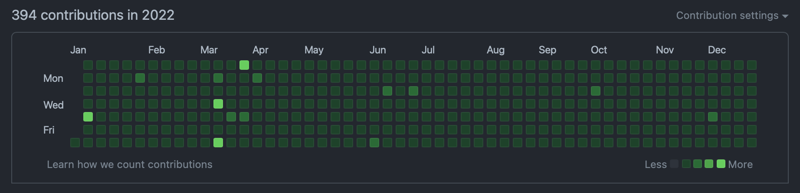

## TL;DR

- GitHub 연속 일일 커밋은 `962`일째 진행중이다. 🌱
- 작년의 가장 큰 성과는 **대형 프로젝트의 성공적인 마무리**다. 😎
- 올해도 **프로젝트 설계**에 초점을 맞춰 공부를 하자. ✍️
- 2023년에도 `설계에 깊이를 더한 iOS 개발자`가 되보자. 💪

## Today I Committed

{:width="100%"}
*GitHub Contributions in 2022*

2022년에도 일일 커밋을 이어가면서 365일을 모두 채워서, 연속 **962일째**를 달성했다. 🥳

물론, 작년도 쉬운 문제를 풀어 잔디를 채우는 것이 주가 되었다.  
작년의 블로그 글이 심각하게 적어(2개..?) 대부분이 문제 풀이 관련 커밋이라 보면 된다.  
다른 일로 바뻐 신경을 많이 쓰지 못했지만, 2년 이상 꾸준하게 **커밋하는 습관**이 생긴 것만으로도 만족스러운 성과라고 생각한다. 😎  

부디 올해에는 문제 풀이가 아닌 다른 커밋으로 가득 차길, 미래의 나에게 바라본다. 🙄

## Today I Worked

재작년에 이직한 후에 규모가 큰 프로젝트도 참여하고, 팀원과의 협업도 제대로 한 것은 작년이 처음이었다.  
전체 프로젝트 기간이 거의 1년으로 긴 호흡으로 진행한 프로젝트였고, 전체적인 설계와 중요한 부분의 담당을 할 수 있어서 뜻깊은 프로젝트였다.  
우리 팀은 각 개발자가 담당하는 영역에 대해 담당자가 원하는 방향으로 설계하도록 자유를 제공하는 방향이라,
서로에게 큰 영향을 주지 않고 독립적으로 개발을 진행할 수 있도록 구성하는 것에 초점을 맞춰 설계를 했다.  
다행히 그 구조는 잘 먹혔고, 큰 이슈 없이 프로젝트가 성공적으로 마무리 되었다. 😎

작년 한 해는 업무적으로 만족스런 해였다.  
꾸준히 담당하던 부분의 유지보수도 별 탈 없이 진행되었으며, 큰 프로젝트를 성공적으로 마치고 그 이후에도 버그가 별로 발생하지 않아서 뿌듯했다.
그리고 열심히 타 부서와 의사소통을 하며 프로젝트를 챙겨서 그런지, 타 부서로부터의 칭찬 피드백도 많이 받아서, 그때 특히 기분이 좋았다. 🥹

올해도 작년의 좋은 피드백을 잊지 않으며, 프로젝트들이 성공적으로 마무리될 수 있도록 힘써봐야겠다! 🔥

## Today I Learned

### 글쓰기

작년에는 블로그 글이 2개.. 심지어 1개는 2021년 회고 글이니 제외한다면, 1개만 올렸던 최저의 해였다.  
진짜 생각하는 의자에 무릎 꿇고 앉아서 하루종일 반성해야겠다는 생각이 들었다.  
변명 아닌 변명으로, 회사 일과 다른 일들에 집중하다보니 바빠서 글을 못 쓰게 되고 미루고 미루다 2023년이 된 것 같다.  
많이 써야 그만큼 쓰는 것이 쉬워지고 부담스럽지 않은 작업이 되는 것인데 일일 커밋처럼 습관들기가 참으로 쉽지 않다. 😂

결론적으로 현재 내 인생의 우선순위에서 많이 밀려난 셈인데,  
**(매번하는 다짐이지만) 올해는 글쓰기의 우선순위를 조금이라도 높여야겠다.** 🙄

### Combine, MVVM

작년 초에 공부 목표로 RxSwift, Combine, MVVM, SwiftUI 등을 정했었는데, 이 중에 Combine, MVVM만 여러모로 맛을 봤던 한 해였다.  
iOS 타겟 버전이 많이 올라와 Combine을 사용하는데 문제가 없어 RxSwift는 자연스레 사용하지 않게 되었고,
SwiftUI는 내가 담당하는 영역이 아직 적용할만한 부분은 아니라서 우선순위를 뒤로 미룬 상태였다.

작년에 회사에서 프로젝트를 진행하며 구조는 MVVM 위주로 설계하고, 신규 프로젝트에는 Combine을 일부 적용시키는 방향으로 개발을 했다.
그 과정에서 더 나은 구조와 코드를 작성할 수 있도록 많이 공부하고 고민하며 시간을 보냈다.  
그 결과, 개인적으로는 만족스러운 구조로 설계되어 유지보수하기 편했으며, Combine은 MVVM 구조와 함께 사용하기에도 적절했다.
특히, 이슈가 발생했을 때 어디를 고쳐야 할지를 바로 알 수 있어서 이슈 처리의 속도가 많이 향상되었다.

하지만, 아직도 MVVM의 베스트 프랙티스가 무엇인지 정립이 안돼서 갈 길이 먼 것 같다.  
MVVM뿐만 아니라 다른 구조도 참고해가며 설계에 대한 시야를 더 깊고 넓게 가져야 할 필요가 있다. 🤔

## Tomorrow I will Learn

### 설계(feat. 디자인 패턴)

설계에 대한 공부는 아직도 끝이 없는 것 같다.  
현재는 MVVM 위주로 설계를 하고 있지만, 다른 패턴의 구조도 자세하게 참고해가며 설계에 대한 공부를 계속 하고자 한다.  
상황에 따라 적절한 패턴이 있을텐데 그때마다 베스트 프랙티스는 무엇인지 정립해서, 어떤 상황에서든 뚝딱뚝딱 설계하는 능력을 기르고 싶다.

### 접근성(Accessibility) 및 그 외 기능들

작년에 접근성(Accessibility) 관련 이슈가 많이 할당되었는데, 다른 일로 바빠서 최대한 미루다보니 올해까지 미뤄지게 되었다.
올해는 몸이 불편하신 분들도 편리하게 쓸 수 있도록 신경써서 접근성 이슈를 처리할 예정이다.
그리고 접근성을 위한 구조를 잡은 후에는 신규 기능이나 화면이 들어갈 때마다 항상 포함되도록 처리할 것이다.  
기존 기능에 영향이 가지 않도록 꼼꼼하게 확인하면서 개발하는 것이 중요할 것 같다.

기회가 된다면, 일반적인 기능이 아닌 비디오, 오디오, 워치, 위젯 등에 대한 것도 담당하고 싶다.  
프로젝트에 참여하게 된다면 공부 속도가 아주 빠르게 가속되기 때문에 가능하면 투입됐으면 좋겠다. 🔥

## Tomorrow I will Become

작년의 목포였던 **설계에 깊이를 더한 iOS 개발자**가 되는 것은 달성했을까?  
개인적으로 조금은 깊어졌다고 생각한다.  
확실히 예전보다 복잡한 프로젝트에 참여하다보니 설계할 때 다양한 사항을 고려해야만 했다.
그 설계 과정을 겪어가며 한층 성장했다고 느꼈다.
하지만, 아직 더 다양한 상황의 프로젝트를 겪어보지 않았기에 여전히 멀었다는 생각이 든다.

결론적으로, 올해의 목표도 작년의 목표와 동일하게 **설계에 깊이를 더한 iOS 개발자**가 되는 것이다.  
올해는 웅덩이가 아닌 우물이 되기를 바라며 열심히 달려가야겠다! 💪
